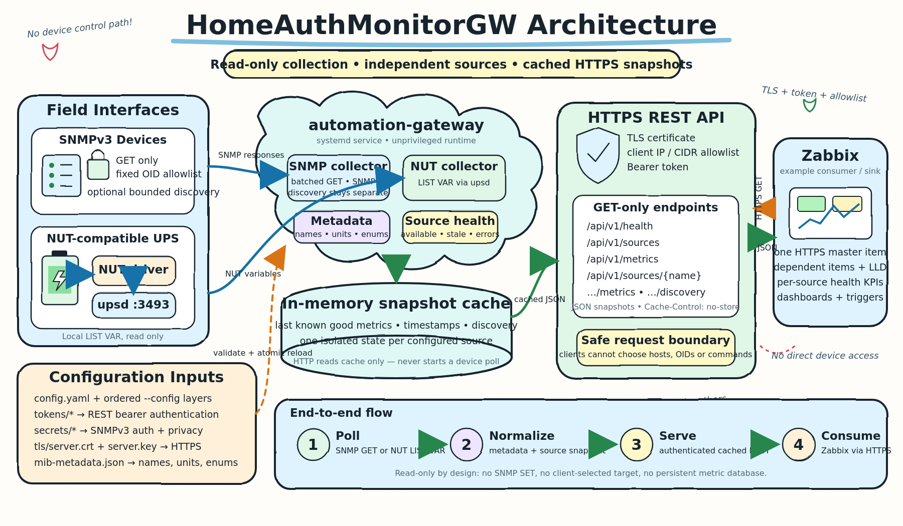

# HomeAuthMonitorGW

HomeAuthMonitorGW is a small, read-only Linux monitoring gateway. It polls configured NUT and SNMPv3 sources, keeps the latest values in memory, and exposes them through an authenticated HTTPS/JSON API for systems such as Zabbix.

[](docs/assets/homeauthmonitorgw-architecture.svg)

- HTTP requests never trigger device access.
- SNMP uses configured GET/BulkWalk operations only; there is no SET path.
- NUT uses `LIST VAR` only.
- Clients cannot supply device addresses, OIDs, or protocol commands.
- One failed source does not stop other collectors; its last successful snapshot becomes stale.

## Contents

- [Software dependencies](#software-dependencies)
- [Build and installation](#build-and-installation)
  - [TLS and token permissions](#tls-and-token-permissions)
- [Cross-build and installation](#cross-build-and-installation)
- [Configuration](#configuration)
  - [NUT](#nut)
  - [SNMPv3](#snmpv3)
- [MIB metadata with `mib2json`](#mib-metadata-with-mib2json)
  - [Which MIB files are needed?](#which-mib-files-are-needed)
- [API and Zabbix](#api-and-zabbix)
  - [WAGO K-bus Visualizer widget](#wago-k-bus-visualizer-widget)
  - [Per-collector health events for Honeycomb](#per-collector-health-events-for-honeycomb)
- [Update and rollback](#update-and-rollback)
- [Security summary](#security-summary)
- [License](#license)

## Software dependencies

**Gateway runtime**

- Linux with systemd and standard Debian-family administration tools.
- No Go toolchain, Net-SNMP package, database, or CGO runtime is required.
- NUT (`nut-server`; `nut-client` provides `upsc`) is required only when this host reads a locally attached UPS.
- A TLS certificate and matching private key must be created or obtained separately, stored securely, and referenced in the configuration.

**Build and installation**

- Git.
- Go 1.23 or newer.
- `sudo` only when invoked by a normal user; root-only systems do not need it. Required system tools are checked automatically by `scripts/install.sh`.
- Internet access during `go mod download`, unless the Go module cache is already populated.

**Optional tools**

- `snmptranslate` from the Debian `snmp` package: required only on the workstation that runs `mib2json`; it is not a gateway runtime dependency.
- Node.js: optional, used only for additional Zabbix JavaScript tests.

Go dependencies are pinned through `go.mod` and `go.sum`: GoSNMP for SNMPv3 and `yaml.v3` for strict YAML parsing.

## Build and installation

The installer handles first installation and updates, accepts a locally modified checkout, and works directly as root. Its fast default downloads modules and builds; request the slower test/vet gates explicitly with `--verify`.

```bash
sudo apt update
sudo apt install --yes ca-certificates git golang-go

git clone https://github.com/tseiman/HomeAuthMonitorGW.git
cd HomeAuthMonitorGW
go version
./scripts/install.sh
```

The installer checks required commands and Go 1.23+, downloads checksummed modules, builds a static binary, and installs:

- `/usr/local/sbin/automation-gateway`
- `/etc/systemd/system/automation-gateway.service`
- `/etc/automation-gateway/config.yaml`
- `/etc/automation-gateway/mib-metadata.json`
- `/etc/automation-gateway/secrets/`
- `/etc/automation-gateway/tokens/`

The example configuration is intentionally not started. Configure the site-specific files, validate them, then start the service:

```bash
./scripts/install.sh --start
sudo systemctl status automation-gateway
sudo journalctl -u automation-gateway -n 50 --no-pager
```

Useful installer options:

- `--binary=PATH`: install a prebuilt binary; Go is not required on the target.
- `--verify`: run tests and vet before building.
- `--verbose` or `-v`: show detailed Go download, verification, and compilation progress.
- `--start`: explicitly enable and start an inactive valid installation.

Existing configuration, metadata, tokens, SNMP/NUT secrets, NUT configuration, and TLS files are preserved. Binary and unit files are replaced only when their content changes. Adjacent `.previous` copies are retained before replacement. Rollback is always an operator decision; the installer never restores them automatically.

### TLS and token permissions

The installer preserves these site-owned files during installation and updates. Directories must be `root:automation-gateway` with mode `0750`; token, certificate, and private-key files must be `root:automation-gateway` with mode `0640`. The service may read credentials but must not replace them.

Create or repair the directories:

```bash
sudo install -d -o root -g automation-gateway -m 0750 \
  /etc/automation-gateway/tokens \
  /etc/automation-gateway/tls
```

Install an existing certificate and key:

```bash
sudo install -o root -g automation-gateway -m 0640 \
  /path/to/fullchain.pem /etc/automation-gateway/tls/server.crt
sudo install -o root -g automation-gateway -m 0640 \
  /path/to/private-key.pem /etc/automation-gateway/tls/server.key
```

Generate and install a URL-safe bearer token without printing it:

```bash
openssl rand -base64 32 | tr -d '=\n' | tr '/+' '_-' | \
  sudo install -o root -g automation-gateway -m 0640 \
  /dev/stdin /etc/automation-gateway/tokens/zabbix
```

Repair existing files and verify everything:

```bash
sudo chown root:automation-gateway \
  /etc/automation-gateway/tokens/zabbix \
  /etc/automation-gateway/tls/server.crt \
  /etc/automation-gateway/tls/server.key
sudo chmod 0640 \
  /etc/automation-gateway/tokens/zabbix \
  /etc/automation-gateway/tls/server.crt \
  /etc/automation-gateway/tls/server.key

stat -c '%U:%G:%a %n' \
  /etc/automation-gateway/tokens \
  /etc/automation-gateway/tokens/zabbix \
  /etc/automation-gateway/tls \
  /etc/automation-gateway/tls/server.crt \
  /etc/automation-gateway/tls/server.key
```

Expected modes are `750` for both directories and `640` for all three files. Reference the token path under `authentication.bearer_token_files` and the certificate paths under `server.certificate` and `server.private_key`.

For a manual build:

```bash
go mod download
GOPROXY=off go test ./...
GOPROXY=off go vet ./...
CGO_ENABLED=0 go build -trimpath -o automation-gateway ./cmd/gateway
./automation-gateway --version
./scripts/install.sh --binary=./automation-gateway
```

## Cross-build and installation

Select the target from its **userspace architecture**, for example with `dpkg --print-architecture`:

- `armhf` → `GOARCH=arm GOARM=7`
- `i386` → `GOARCH=386`
- `arm64` → `GOARCH=arm64`
- `amd64` → `GOARCH=amd64`

Build on the build host:

```bash
CGO_ENABLED=0 GOOS=linux GOARCH=arm GOARM=7 go build -trimpath -o automation-gateway-linux-armv7 ./cmd/gateway
CGO_ENABLED=0 GOOS=linux GOARCH=386 go build -trimpath -o automation-gateway-linux-386 ./cmd/gateway
CGO_ENABLED=0 GOOS=linux GOARCH=arm64 go build -trimpath -o automation-gateway-linux-arm64 ./cmd/gateway
CGO_ENABLED=0 GOOS=linux GOARCH=amd64 go build -trimpath -o automation-gateway-linux-amd64 ./cmd/gateway
```

Copy the matching artifact and a repository checkout to the target, then run:

```bash
cd HomeAuthMonitorGW
./scripts/install.sh --binary=/path/to/automation-gateway-linux-armv7
```

The binary-install path still checks the target's systemd and administration commands, but it does not require Go or download modules.

## Configuration

Start with [`configs/config.example.yaml`](configs/config.example.yaml). Important settings:

- `server.listen`: HTTPS listen address.
- `server.certificate`, `server.private_key`: securely stored TLS files; the installer never creates or changes them.
- `authentication.bearer_token_files`: protected token files containing 16–4096 non-whitespace bytes.
- `authentication.allowed_clients`: exact client IPs or canonical CIDRs; forwarding headers are ignored.
- `sources[].driver`: `nut` or `snmp`.
- `sources[].poll_interval`, `stale_after`, `timeout`: bounded source timing.
- `sources[].nut.ups`: exact upsd UPS name.
- `sources[].snmp.oids`: fixed normal-poll OID allowlist.
- `sources[].snmp.discovery.root_oids`: optional fixed startup/reload BulkWalk roots.
- `sources[].snmp.metadata_file`: optional JSON generated by `mib2json`.
- CLI layering: repeat `--config=PATH` (short: `-C=PATH`) up to 32 times; later mappings override earlier keys, while lists and scalar values replace them. `--check`/`-c`, `--foreground`/`-f`, `--log-level=debug`/`-l=debug`, and `--version`/`-V` are accepted. CLI logging flags override YAML.

Site-owned configuration and secret files should normally be root-owned, group-readable by `automation-gateway`, and mode `0640`. Secret files must be regular files, not symlinks or devices, and must not be accessible to “other”. Configuration, secrets, tokens, and TLS directories must be `root:automation-gateway` with mode `0750`; the service account may read but must not replace its credentials.

If an older/manual setup made the token directory service-owned, repair it with:

```bash
sudo chown root:automation-gateway /etc/automation-gateway/tokens
sudo chmod 0750 /etc/automation-gateway/tokens
sudo chown root:automation-gateway /etc/automation-gateway/tokens/zabbix
sudo chmod 0640 /etc/automation-gateway/tokens/zabbix
```

Install an existing certificate and private key at the example configuration paths:

```bash
sudo install -d -o root -g automation-gateway -m 0750 /etc/automation-gateway/tls
sudo install -o root -g automation-gateway -m 0640 /path/to/fullchain.pem /etc/automation-gateway/tls/server.crt
sudo install -o root -g automation-gateway -m 0640 /path/to/private-key.pem /etc/automation-gateway/tls/server.key
```

Generate and install a URL-safe bearer token without printing it to the terminal:

```bash
openssl rand -base64 32 | tr -d '=\n' | tr '/+' '_-' | \
  sudo install -o root -g automation-gateway -m 0640 /dev/stdin /etc/automation-gateway/tokens/zabbix
```

Reference `/etc/automation-gateway/tokens/zabbix` under `authentication.bearer_token_files`.

Validate with the real service identity:

```bash
sudo -u automation-gateway /usr/local/sbin/automation-gateway \
  --config=/etc/automation-gateway/config.yaml \
  --check
```

Reload after reloadable changes; restart after changing the listen address or server timeout limits:

```bash
# Choose reload for reloadable source/auth/TLS changes:
sudo systemctl reload automation-gateway
# Or restart after changing listen/timeout settings:
sudo systemctl restart automation-gateway
sudo journalctl -u automation-gateway -n 50 --no-pager
```

At `info`, the gateway logs every HTTP request and every successful poll; poll failures are always errors. At `debug`, it additionally logs poll starts and returned metric values. Follow service activity with:

```bash
sudo journalctl -fu automation-gateway
/usr/local/sbin/automation-gateway --foreground --log-level=debug
```

### NUT

- The gateway does not access USB directly: UPS → NUT driver → local upsd → gateway.
- Keep upsd on `127.0.0.1:3493` unless the site explicitly requires otherwise.
- Use the exact UPS section name from `/etc/nut/ups.conf` in `sources[].nut.ups`.
- Test locally with `upsc UPS_NAME@127.0.0.1` before starting the gateway.
- `upsd` listening on port 3493 is not sufficient: the matching `nut-driver@UPS_NAME` must be active and `upsc` must return values. Otherwise health is `degraded`, the source is `stale`, and the gateway error log contains the concrete upsd or connection error.

### SNMPv3

- Configure the device address, authPriv account, auth protocol, privacy protocol, protected passphrase files containing 8–255 bytes, and a fixed OID list.
- Normal polling partitions the fixed list into bounded GET requests. `max_oids_per_request` defaults to `16` and accepts `1`–`32`; lower it for constrained embedded agents without removing OIDs from the allowlist. The WAGO 750-880 was observed to reject a 19-varbind GET with an unrecognized SNMPv3 report PDU while accepting 18, so `16` leaves a safety margin.
- A failed GET log identifies the affected one-based OID range, for example `OIDs 17-32 of 132`.
- Keep each OID only once. Duplicate entries waste device request capacity.
- Keep legacy SHA1/DES devices isolated inside the automation network.
- Do not treat a username such as `readonly` as proof that the device rejects writes; gateway safety comes from network policy and the absence of write code.

## MIB metadata with `mib2json`

A MIB describes names, numeric OIDs, units, types, and enum values. It does not tell the gateway what to poll: selected numeric OIDs must still be placed in `sources[].snmp.oids` or under a reviewed discovery root.

Install and build the offline tool on an admin/build workstation:

```bash
sudo apt install --yes snmp
snmptranslate -V
go build -trimpath -o mib2json ./cmd/mib2json
```

### Which MIB files are needed?

1. Obtain the MIB package for the exact device family and firmware from the device manufacturer or its support portal.
2. The primary file declares its module name near `DEFINITIONS ::= BEGIN`.
3. Its `IMPORTS` section references other modules after `FROM`. These are **dependent MIBs**. Dependencies can import further modules recursively.
4. Put the complete vendor package and required standard/vendor dependencies into one or more local directories. Do not rename module declarations inside the files.
5. Run `--list-symbols`. Messages such as `Cannot find module (SNMPv2-SMI)` name the missing dependency. Obtain that module from the vendor package or a trusted distribution source, add its directory, and repeat until no module/import errors remain.

Debian's `snmp` package provides `snmptranslate` but may not include all IETF MIB files. A vendor package may therefore need additional standard MIBs even though the command itself is installed.

List available symbols and numeric OIDs:

```bash
./mib2json \
  --mib-dir ./mibs/vendor \
  --mib-dir ./mibs/dependencies \
  --module VENDOR-MIB \
  --list-symbols
```

The list includes structural nodes and symbols imported from dependencies. Use the device manual/OID list and the primary MIB to select the readable `OBJECT-TYPE` entries that represent the values you actually need.

Convert only reviewed objects:

```bash
./mib2json \
  --mib-dir ./mibs/vendor \
  --mib-dir ./mibs/dependencies \
  --module VENDOR-MIB \
  --object deviceTemperature \
  --object deviceAlarmState \
  --output ./vendor-metadata.json

sudo install -o root -g automation-gateway -m 0640 \
  ./vendor-metadata.json \
  /etc/automation-gateway/vendor-metadata.json
```

Then set `sources[].snmp.metadata_file`, add the required numeric OIDs to the configured allowlist, and run the configuration check. `mib2json` never contacts a device and accepts no address or credentials. Review MIB licensing before redistributing vendor files or generated descriptions.

For a WAGO 750-880, [`configs/wago-750-880-metadata.example.json`](configs/wago-750-880-metadata.example.json) provides 132 reviewed, instance-specific definitions for system identity, interface health, firmware, diagnostics, IEC task health, Modbus capacity, and the discovered 19-slot K-bus inventory. Its descriptions are operational guidance rather than copied MIB prose. In particular, it does not invent undocumented numeric meanings for IEC task status or mode.

```bash
sudo install -o root -g automation-gateway -m 0640 \
  configs/wago-750-880-metadata.example.json \
  /etc/automation-gateway/wago-750-880-metadata.json
```

Reference it in the matching source and reload only after a successful configuration check:

```yaml
metadata_file: "/etc/automation-gateway/wago-750-880-metadata.json"
```

## API and Zabbix

Every endpoint requires both an allowed TCP peer and a bearer token:

- `GET /api/v1/health`
- `GET /api/v1/sources`
- `GET /api/v1/sources/{name}`
- `GET /api/v1/sources/{name}/metrics`
- `GET /api/v1/sources/{name}/discovery`
- `GET /api/v1/metrics`

Import [`zabbix/template_homeauthmonitorgw.yaml`](zabbix/template_homeauthmonitorgw.yaml), set `{$AUTOMATION_GATEWAY_URL}`, secret `{$AUTOMATION_GATEWAY_TOKEN}`, `{$AUTOMATION_GATEWAY_INTERVAL}`, and `{$AUTOMATION_GATEWAY_TIMEOUT}`, and keep certificate verification enabled. Add the Zabbix server/proxy's actual TCP source address to `authentication.allowed_clients`. The template uses one HTTP master item and dependent discovery/items; it never contacts NUT or SNMP devices directly.

The template stores strings as text and numeric metrics as trendable numeric items. SNMP TimeTicks are converted from centiseconds to seconds; `sysUpTime` uses Zabbix's `uptime` unit for a human-readable duration. The WAGO RTC value map displays `0` as `OK` and `1` as `Battery empty` without changing the numeric value used for alerting.

Two independent device views are included:

- **WAGO 750-880**: service health, human-readable uptime, diagnostic text, error code, RTC battery, firmware, CODESYS project and IEC task details, ordered K-bus module inventory, and cycle-time history. A warning trigger records any change to the reported K-bus slot/article/type signature.
- **Phoenix Contact UPS**: service health, NUT status, model, charge, runtime, battery temperature, output voltage, and battery history.

The core items and dashboards use `{$WAGO_SOURCE}` and `{$PHOENIX_SOURCE}`. Their defaults match the example deployment (`wago-750-880-snmp3` and `ups-main`); override them at host level when source names differ. Phoenix warning and critical thresholds are controlled by `{$PHOENIX_BATTERY_WARNING}`, `{$PHOENIX_BATTERY_CRITICAL}`, `{$PHOENIX_TEMPERATURE_WARNING}`, and `{$PHOENIX_TEMPERATURE_CRITICAL}`. The WAGO and Phoenix health items and triggers are separate. An error in one collector does not change the other collector's individual health.

`{$WAGO_MODULE_DESCRIPTIONS}` is kept as a compatibility shim consumed only by the `automation.gateway.wago.module_inventory` text item. The canonical, user-editable description table is now maintained in the **wago_kbus widget source** (`zabbix/modules/wago_kbus/views/widget.view.php`, the `$WAGO_DESCRIPTIONS` array). It ships with entries for the most common 750-series modules and requires a widget update — not a template re-import — when new articles are added.

Every source discovered later also receives its own `automation.gateway.source.health["<source>"]` item automatically. All individual and overall Zabbix health item names start with `TS Service health: `, so `{{ITEM.NAME}.regsub("^TS Service health: (.*)$", "\1")}` returns the service name. All use the same three values:

- `0` — **Good**: reachable, fresh, non-empty data and all applicable known checks pass.
- `1` — **Degraded**: not initialized, stale, empty data, missing expected health metrics, a warning threshold, or another non-critical condition.
- `2` — **Real issue / unavailable**: the collector is unavailable, a confirmed device error is present, or a critical threshold is crossed.

`automation.gateway.health.overall` is the layer above every collector. The highest state wins (`max`), so a real issue (`2`) dominates degraded (`1`) and good (`0`). Before the HTTPS master item has received its first snapshot, dependent items cannot have a value; the separate master-item `nodata(...,5m)` trigger covers that condition. A valid snapshot with no configured sources returns degraded (`1`).

### WAGO K-bus Visualizer widget

The **wago_kbus** custom widget renders a horizontal SVG rail of the WAGO controller and all
K-bus modules in numeric slot order. It is included in the WAGO 750-880 dashboard as a
replacement for the plain-text K-bus inventory widget. It supports 19+ modules through
horizontal scrolling and shows a tooltip with article number, description, and type code on
hover.

#### Prerequisites

- PHP 8.x (the Zabbix frontend PHP version).
- Zabbix 7.4 with module management enabled (`Administration → General → Modules`).
- The HomeAuthMonitorGW Zabbix template imported (this provides the
  `automation.gateway.wago.kbus_layout` item that the widget reads).

#### Widget installation

Use the provided install script for both first install and updates.  It validates the
destination, stages the new version, atomically replaces the previous installation
(removing stale files), and sets `www-data` ownership.  Running it a second time is safe.

```bash
# Clone or update the repository first:
git clone https://github.com/tseiman/HomeAuthMonitorGW.git
cd HomeAuthMonitorGW

# Install or update (run as root/sudo):
sudo ./scripts/install_widget.sh

# Preview without making changes:
./scripts/install_widget.sh --dry-run

# Override the Zabbix modules path (default: /usr/share/zabbix/modules):
sudo ./scripts/install_widget.sh --zabbix-modules-dir /var/www/html/zabbix/modules
```

> **Note:** Do not use `cp -r zabbix/modules/wago_kbus /usr/share/zabbix/modules/` directly
> for updates — if the destination already exists, `cp -r` nests the source inside it and
> leaves stale files.  The install script avoids this with a stage-and-swap.

#### Enable the widget in Zabbix

1. In the Zabbix web UI: **Administration → General → Modules**.
2. Click **Scan directory** if *WAGO K-bus Visualizer* does not appear.
3. Click the **Disabled** toggle to enable the module.

#### Template import / update

```bash
# First import: via Zabbix UI → Configuration → Templates → Import
# zabbix/template_homeauthmonitorgw.yaml

# Or with Zabbix CLI (example using zabbix_sender is not applicable here; use UI import).
```

Import `zabbix/template_homeauthmonitorgw.yaml` through the Zabbix UI.  Select "Update" for all
object types when re-importing over an existing version of the template.  The
`automation.gateway.wago.kbus_layout` item (added in this release) will be created
automatically.  The WAGO 750-880 dashboard will now show the K-bus Visualizer widget at
position (x=24, y=9) instead of the previous text-based inventory widget.

#### Controller SVG identification

The widget reads the `wioArticleName` SNMP metric (OID `1.3.6.1.4.1.13576.10.1.1.0`) to
determine the controller model.  If your WAGO gateway configuration includes this OID (it is in
`configs/wago-750-880-metadata.example.json`), the widget will select the matching SVG
automatically.  If `wioArticleName` is not collected, the generic controller fallback SVG
(`wago_0750-xxxx_controller.svg`) is used instead.

**Current controller SVG mapping:**

| Article | SVG file |
|---------|----------|
| 750-880 | `wago_0750-0880.svg` |
| All others | `wago_0750-xxxx_controller.svg` (fallback) |

#### Module SVG matching rules

- **Concrete article** such as `750-511` or `750-511/000-002`: the variant suffix is stripped,
  the base article is looked up in the server-side allowlist, and the matching SVG is served.
- **Wildcard/family pattern** such as `750-5xx` or `750-4xx`: the lowercase `x` marks a
  non-concrete identifier; these always use the generic module fallback
  (`wago_0750-xxxx_modul.svg`).

**Current module SVG mapping:**

| Article (base) | SVG file |
|----------------|----------|
| 750-511 | `wago_0750-0511.svg` |
| All others | `wago_0750-xxxx_modul.svg` (fallback) |

#### Custom SVG assets — persistent, update-safe

Custom SVG files and their article mappings live under `/var/lib/zabbix/wago_kbus/`, which
is **completely separate from the package-managed module tree** at
`/usr/share/zabbix/modules/wago_kbus/`.  Running `install_widget.sh` to update the widget
never touches `/var/lib/zabbix/wago_kbus/` — custom assets survive every widget update.

> **FHS rationale:** `/var/lib` is the standard Linux location for persistent, mutable
> application state.  `/usr/share` is for read-only, package-managed files.  Keeping custom
> data in `/var/lib` gives a clean separation: the widget vendor manages `/usr/share`, the
> site admin manages `/var/lib`.

**Directory layout created automatically by `install_widget.sh`:**

```
/var/lib/zabbix/wago_kbus/
├── custom_svg_map.json    # article → filename mapping (root:www-data 640)
└── images/                # custom SVG files          (root:www-data 750)
    └── *.svg
```

Permissions are set root-owned and group-readable (not group-writable) so the web server
process can read assets but cannot modify its own configuration.  If your Zabbix frontend
runs under a group other than `www-data`, pass `--web-group GROUP` to `install_widget.sh`.

**`custom_svg_map.json` schema:**

```json
{
  "controllers": {
    "750-881": "wago_custom_881.svg"
  },
  "modules": {
    "750-600": "wago_0750-0600.svg",
    "750-5xx": "wago_generic_5xx.svg"
  }
}
```

- Keys follow the same WAGO article format as the built-in maps.
- Concrete variant keys (e.g. `750-511/000-002`) are looked up exactly before the base
  is normalised; `750-511/000-002` and `750-511` can have different SVGs.
- Generic keys containing `x` (e.g. `750-5xx`) are supported only as explicit exact keys —
  they never accidentally absorb a concrete article like `750-511`.
- Custom entries override built-in entries with the same key.
- Malformed JSON, missing sections, unreadable files, and symlinks are silently skipped;
  the widget falls back to built-in SVGs without breaking.

**Fallback hint in tooltips:** when a controller or module uses the generic fallback SVG
(because no specific SVG is configured), its hover tooltip appends a brief hint showing the
normalized key to add and the paths to use.  The hint is visible on hover only and does not
appear on the main rail.

##### Installing the custom data directory

`install_widget.sh` creates the layout on first install only:

```bash
sudo ./scripts/install_widget.sh
# For a non-www-data frontend group:
sudo ./scripts/install_widget.sh --web-group apache
```

##### Adding a custom SVG

```bash
# 1. Copy the SVG to the images directory:
sudo cp wago_custom_881.svg /var/lib/zabbix/wago_kbus/images/
sudo chown root:www-data /var/lib/zabbix/wago_kbus/images/wago_custom_881.svg
sudo chmod 640 /var/lib/zabbix/wago_kbus/images/wago_custom_881.svg

# 2. Register it in the map (edit as root):
sudo nano /var/lib/zabbix/wago_kbus/custom_svg_map.json
# Add under "controllers": { "750-881": "wago_custom_881.svg" }

# 3. No widget reinstall or Zabbix restart needed.
#    The widget reads the map on every page render.
```

##### Updating a custom SVG

Replace the file in place.  The map entry does not need to change.

```bash
sudo cp new_wago_custom_881.svg /var/lib/zabbix/wago_kbus/images/wago_custom_881.svg
sudo chown root:www-data /var/lib/zabbix/wago_kbus/images/wago_custom_881.svg
sudo chmod 640 /var/lib/zabbix/wago_kbus/images/wago_custom_881.svg
```

##### Removing a custom SVG

Remove the key from `custom_svg_map.json` (the file itself can stay or be deleted).  The
widget will fall back to the built-in SVG for that article.

##### Backup and restore

```bash
# Backup:
sudo tar -czf wago_kbus_custom_$(date +%Y%m%d).tar.gz /var/lib/zabbix/wago_kbus/

# Restore:
sudo tar -xzf wago_kbus_custom_20261005.tar.gz -C /
sudo chown -R root:www-data /var/lib/zabbix/wago_kbus/
sudo chmod 750 /var/lib/zabbix/wago_kbus/ /var/lib/zabbix/wago_kbus/images/
sudo chmod 640 /var/lib/zabbix/wago_kbus/custom_svg_map.json
sudo chmod 640 /var/lib/zabbix/wago_kbus/images/*.svg
```

##### Multi-frontend synchronization

Zabbix HA or load-balanced deployments have one frontend per node; each reads
`/var/lib/zabbix/wago_kbus/` locally.  Synchronize custom assets across nodes with
configuration management (Ansible, Puppet, Chef) or a shared NFS mount at that path.

Example Ansible task:

```yaml
- name: Sync wago_kbus custom assets
  synchronize:
    src: /var/lib/zabbix/wago_kbus/
    dest: /var/lib/zabbix/wago_kbus/
  delegate_to: primary_zabbix_frontend
```

#### Adding a new built-in module SVG (for contribution to this repo)

Use this path when an SVG should ship with the widget for all users, not just
your site.  Site-specific SVGs belong in the custom asset dir above.

1. Obtain the `.elmt` source from the qelectrotech-elements repository (CC BY 4.0; see
   `tooling/qet_to_svg/PROVENANCE.md` for full attribution requirements).

   ```bash
   # Fetch one element — replace the path with the actual upstream path:
   curl -sSL \
     "https://raw.githubusercontent.com/qelectrotech/qelectrotech-elements/master/sources/industrial/WAGO/750-NNN/element.elmt" \
     -o wago_0750-NNNN.elmt

   # Convert to SVG:
   python3 tooling/qet_to_svg/qet_to_svg.py wago_0750-NNNN.elmt \
     -o zabbix/modules/wago_kbus/assets/img/ --force
   ```

2. Add the article base → filename mapping to `$SVG_MODULE_MAP` in
   `zabbix/modules/wago_kbus/views/widget.view.php`.

3. Optionally add a human-readable description to `$WAGO_DESCRIPTIONS` in the same file.

4. Re-install the widget: `sudo ./scripts/install_widget.sh`.
   The script replaces the installed directory atomically; re-running it is safe and idempotent.

5. Run the widget tests to confirm no regressions:
   ```bash
   go test ./zabbix/...
   ```

#### Verification

After installation and template import:

```bash
# Verify the item exists and returns data (replace HOST and ZABBIX_URL):
# In Zabbix UI: Monitoring → Latest data → filter host → search "kbus_layout"

# Check the item preprocessing runs correctly (run from this directory):
go test ./zabbix/... -run TestKbusLayout -v

# Verify SVG assets are well-formed:
go test ./zabbix/... -run TestWidgetSvg -v

# Full widget test suite (PHP tests require php CLI):
go test ./zabbix/... -v
```

### Per-collector health events for Honeycomb

[`scripts/health-kpi.py`](scripts/health-kpi.py) reads the same authenticated snapshot and emits one compact NDJSON event per collector. It deliberately emits no global aggregate, so `collector_name` can be used as the Honeycomb breakdown and each collector retains its own `health_status`, `health_score`, warning count, critical count, and reasons.

```bash
./scripts/health-kpi.py \
  --url=https://monitor.example.invalid \
  --token-file=/etc/automation-gateway/tokens/zabbix
```

The token is read from a protected regular file and is never included in output. For offline checks or an existing data pipeline, pass an API response directly:

```bash
./scripts/health-kpi.py --input=/secure/path/gateway-metrics.json
# or: curl ... | ./scripts/health-kpi.py --input=-
```

WAGO events include the readable diagnostic string such as `Coupler running, OK`, uptime in seconds, RTC state, error group/code, IEC task values, Modbus capacity, K-bus module count, and firmware. Phoenix events include NUT status, battery charge/runtime/temperature/voltage, output voltage/current, and model. A WAGO RUN-state check is intentionally disabled until the numeric RUN/STOP meaning has been confirmed on the device; afterwards it can be enabled for the script with `--wago-run-status=<value>`.

The script only writes the events to stdout. Send that stdout through the site's existing OpenTelemetry Collector, Vector, Fluent Bit, or other approved Honeycomb ingestion path rather than placing a Honeycomb API key on the gateway.

## Update and rollback

Update from a clean checkout with the same installer:

```bash
cd HomeAuthMonitorGW
git status --short
git pull --ff-only
./scripts/install.sh
sudo systemctl status automation-gateway
```

If the operator chooses to restore existing `.previous` files:

```bash
sudo install -o root -g root -m 0755 /usr/local/sbin/automation-gateway.previous /usr/local/sbin/automation-gateway
sudo install -o root -g root -m 0644 /etc/systemd/system/automation-gateway.service.previous /etc/systemd/system/automation-gateway.service
sudo systemctl daemon-reload
sudo systemctl restart automation-gateway
```

## Security summary

- Keep forwarding disabled and permit HTTPS only from approved monitoring clients.
- Keep upsd loopback-only and field-device protocols inside the automation network.
- Never place tokens, SNMP passphrases, or private keys in YAML, source control, command lines, tickets, or logs.
- Keep every API endpoint, including health, behind the client allowlist and bearer-token policy.
- Discovery roots and normal OIDs are administrator configuration, never API input.

## License

See [LICENSE](LICENSE).
