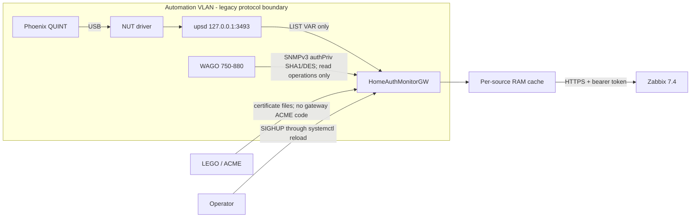

# HomeAuthMonitorGW

HomeAuthMonitorGW is a small, read-only monitoring gateway for Linux systems. It polls NUT/upsd and configured automation devices over SNMPv3, keeps independent in-memory source snapshots, and exposes only a controlled HTTPS/JSON API for monitoring clients such as Zabbix. It is designed to run on resource-constrained edge systems as well as conventional Linux servers.

The service is **not** an SNMP, NUT, or HTTP proxy. HTTP clients cannot choose an OID, protocol operation, NUT command, or device address. The production SNMP adapter implements GET and BulkWalk only; there is no SNMP SET path.

## Contents

- [Architecture and trust boundaries](#architecture-and-trust-boundaries)
- [Supported sources and constraints](#supported-sources-and-constraints)
- [Build and test](#build-and-test)
- [Blank-host installation](#blank-host-installation)
- [NUT, upsd, and USB](#nut-upsd-and-usb)
- [WAGO SNMPv3](#wago-snmpv3)
- [Configuration and secrets](#configuration-and-secrets)
- [Command-line interface](#command-line-interface)
- [MIB metadata and discovery](#mib-metadata-and-discovery)
- [TLS, LEGO, and reload](#tls-lego-and-reload)
- [API reference](#api-reference)
- [Zabbix 7.4 template](#zabbix-74-template)
- [Service operation and logging](#service-operation-and-logging)
- [Firewall migration](#firewall-migration)
- [Update, rollback, and removal](#update-rollback-and-removal)
- [Troubleshooting](#troubleshooting)
- [Security considerations](#security-considerations)

## Architecture and trust boundaries



Trust boundaries:

1. USB and SNMP are inside the automation network. Old SHA1/DES support remains there only where a configured field device requires it.
2. The gateway host is an endpoint, not a router. Do not enable IP forwarding.
3. Zabbix reaches one HTTPS listener. The API returns configured source data only.
4. Bearer, SNMP auth, and SNMP privacy values live in separate files. They are never returned or intentionally logged.
5. Each collector polls independently. HTTP never performs a poll. A failed collector retains its last-known-good values and marks them stale without stopping another source or the daemon.

The internal `drivers.Collector` and optional `drivers.Discoverer` interfaces use protocol-independent `metrics.Metric` and `metrics.Definition` values. Drivers are compiled into one binary. A future Unix-domain-socket adapter can implement the same boundary; dynamic plugins and IPC are intentionally outside v1.

## Supported sources and constraints

- **NUT:** TCP client to upsd, normally `127.0.0.1:3493`; sends only `LIST VAR <configured-ups>`.
- **SNMP:** SNMPv3 authPriv with SHA/SHA1 authentication and DES privacy through pinned GoSNMP. Normal polls issue GET for a fixed configuration allowlist. Optional startup/reload discovery issues BulkWalk for fixed roots.
- **HTTPS:** one TLS 1.2-or-newer server and source-oriented v1 API.

No database, generic protocol endpoint, write/control command, pprof listener, directory server, ACME client, Modbus replacement, or CODESYS replacement is included.

## Build and test

Requirements are Go 1.23 or newer and Git. Dependencies are deliberately limited:

- `github.com/gosnmp/gosnmp v1.42.1`: SNMPv3/authPriv and read operations.
- `gopkg.in/yaml.v3 v3.0.1`: strict YAML decoding.

```bash
git clone https://github.com/tseiman/HomeAuthMonitorGW.git
cd HomeAuthMonitorGW
go version
go mod download
go test ./...
go vet ./...
go build -trimpath -ldflags "-s -w -X main.version=1.0.0 -X main.commit=$(git rev-parse HEAD) -X main.buildTime=$(date -u +%Y-%m-%dT%H:%M:%SZ)" -o automation-gateway ./cmd/gateway
./automation-gateway --version
```

Select the build target from the operating system's userspace architecture:

```bash
GOOS=linux GOARCH=arm GOARM=7 go build -trimpath -o automation-gateway-linux-armv7 ./cmd/gateway
GOOS=linux GOARCH=386 go build -trimpath -o automation-gateway-linux-386 ./cmd/gateway
GOOS=linux GOARCH=arm64 go build -trimpath -o automation-gateway-linux-arm64 ./cmd/gateway
GOOS=linux GOARCH=amd64 go build -trimpath -o automation-gateway-linux-amd64 ./cmd/gateway
```

Use `dpkg --print-architecture` on Debian-family systems and map `armhf` to `arm/7`, `i386` to `386`, `arm64` to `arm64`, and `amd64` to `amd64`. Builds are pure Go and do not require CGO. A KUNBUS Revolution Pi Core 3 is one supported deployment example and commonly uses an `armhf` userspace, but the installed OS—not the hardware product name—determines the correct artifact.

## Blank-host installation

The recommended path builds on a workstation or directly on the destination host with Go 1.23+. On a blank Debian-family host:

```bash
sudo apt update
sudo apt install --yes ca-certificates git golang-go nut nut-client openssl curl

go version
git --version
```

Stop if `go version` is older than 1.23; install a supported Go toolchain from the official Go distribution or deploy the cross-built ARMv7 binary instead. Then build and stage:

```bash
git clone https://github.com/tseiman/HomeAuthMonitorGW.git
cd HomeAuthMonitorGW
go mod download
go test ./...
go build -trimpath -o automation-gateway ./cmd/gateway
sudo install -o root -g root -m 0755 automation-gateway /usr/local/sbin/automation-gateway
```

Create a non-login service identity and protected paths:

```bash
sudo adduser --system --group --no-create-home --home /nonexistent automation-gateway
sudo install -d -o root -g automation-gateway -m 0750 /etc/automation-gateway
sudo install -d -o root -g automation-gateway -m 0750 /etc/automation-gateway/secrets
sudo install -d -o root -g automation-gateway -m 0750 /etc/automation-gateway/tokens
sudo install -o root -g automation-gateway -m 0640 configs/config.example.yaml /etc/automation-gateway/config.yaml
sudo install -o root -g automation-gateway -m 0640 configs/mib-metadata.example.json /etc/automation-gateway/mib-metadata.json
sudo install -o root -g root -m 0644 systemd/automation-gateway.service /etc/systemd/system/automation-gateway.service
```

Provision secrets without putting them in shell arguments or history. Run each command, enter the value, and press Enter; every physical target must be provisioned separately:

```bash
sudo sh -c 'umask 027; read -r value; printf "%s\n" "$value" > /etc/automation-gateway/tokens/zabbix; unset value'
sudo sh -c 'umask 027; read -r value; printf "%s\n" "$value" > /etc/automation-gateway/tokens/maintenance; unset value'
sudo sh -c 'umask 027; read -r value; printf "%s\n" "$value" > /etc/automation-gateway/secrets/controller-auth; unset value'
sudo sh -c 'umask 027; read -r value; printf "%s\n" "$value" > /etc/automation-gateway/secrets/controller-priv; unset value'
sudo chown root:automation-gateway /etc/automation-gateway/tokens/zabbix /etc/automation-gateway/tokens/maintenance /etc/automation-gateway/secrets/controller-*
sudo chmod 0640 /etc/automation-gateway/tokens/zabbix /etc/automation-gateway/tokens/maintenance /etc/automation-gateway/secrets/controller-*
```

Configure NUT, SNMP, host addresses, and TLS as described below. Validate before starting:

```bash
sudo -u automation-gateway /usr/local/sbin/automation-gateway --config /etc/automation-gateway/config.yaml --check
sudo systemd-analyze verify /etc/systemd/system/automation-gateway.service
sudo systemctl daemon-reload
sudo systemctl enable --now automation-gateway
sudo systemctl status automation-gateway
sudo journalctl -u automation-gateway -n 50 --no-pager
```

The unit grants only `CAP_NET_BIND_SERVICE`, so the unprivileged process can bind port 443. Port 8443 is an alternative: change `server.listen` and remove both capability directives from the unit.

## NUT, upsd, and USB

The gateway does not access USB itself:

```text
Phoenix QUINT -> USB -> NUT hardware driver -> local upsd -> gateway LIST VAR
```

Identify the UPS as an administrator:

```bash
lsusb
sudo nut-scanner -U
```

Use the NUT driver reported for the device and follow the installed driver's man page. A typical `/etc/nut/ups.conf` shape is shown below; the actual driver and USB selectors must come from local discovery, not from this example:

```ini
[quint]
    driver = usbhid-ups
    port = auto
    desc = Phoenix QUINT UPS
```

Set `/etc/nut/nut.conf`:

```ini
MODE=standalone
```

Restrict `/etc/nut/upsd.conf` to loopback:

```ini
LISTEN 127.0.0.1 3493
```

Read-only `LIST VAR` normally needs no NUT user. Do not add a control-capable user for this gateway. The NUT package's udev rules should grant the driver access; after editing rules, use `udevadm control --reload` and reconnect the UPS. Diagnose ownership with `journalctl -u nut-driver@quint` (unit naming varies by NUT package) and test locally:

```bash
sudo systemctl restart nut-server
upsc quint@127.0.0.1
ss -ltn | grep 3493
```

`upsd` must not listen on the intranet or automation interface. Configure `sources[].nut.ups` to the exact NUT section name (`quint` above), not a display label or USB address.

## SNMPv3 example: WAGO

The sample targets `192.168.1.11:161`, SNMPv3 authPriv, SHA/SHA1, and DES. Replace the account name and secret files with the site's provisioned monitoring account. The historical account name `readonly` is not a security guarantee: the device was observed accepting a write under that account. Network isolation and the absence of a write code path are therefore mandatory.

Normal polling reads only the fixed `sources[].snmp.oids` list. Neither query parameters nor request bodies alter it. If the field device intentionally has no default gateway, keep SNMP local to the automation network. Configure the gateway host with an address that reaches the device directly and an intranet-facing route only as required for HTTPS, but do not enable forwarding.

Verify from the gateway host with the distribution SNMP tools only during commissioning, entering credentials interactively or through protected files according to local policy. Never paste passphrases into shared shell history. Once the gateway works, remove direct monitoring-client-to-device SNMP routing as described under Firewall migration.

## Configuration and secrets

[`configs/config.example.yaml`](configs/config.example.yaml) is complete. YAML unknown fields, extra documents, malformed durations/OIDs, unsupported SNMP modes, missing references, insecure secret modes, and invalid TLS keypairs make `--check` fail. Secret paths must be regular files rather than symlinks or devices. Secrets may be owner-readable or owner/group-readable, but never accessible to “other” and never group-writable. Bearer tokens must contain 16–4096 non-whitespace bytes; SNMPv3 passphrases must contain 8–255 bytes. Secret files are read through one bounded descriptor and may end in one line ending, but may not contain embedded control characters.

Important fields:

- `sources`: zero or more independently named collector instances. Multiple sources may use the same driver.
- `sources[].name`: the stable API/Zabbix source name and one safe URL path segment.
- `sources[].driver`: statically linked `nut` or `snmp` implementation.
- `sources[].enabled`: defaults to `true`. A `false` entry is ignored completely: its semantic values, referenced files, connection, cache entry, and worker are not used. Unknown YAML keys are still rejected.
- `authentication.bearer_token_files`: one to 32 protected token files; any one token can authenticate. Token digests are precomputed for request handling.
- `authentication.allowed_clients`: one to 128 IPv4/IPv6 addresses or canonical CIDR networks. CIDRs with host bits and IPv4-mapped CIDRs are rejected rather than silently widened. The real TCP peer from `RemoteAddr` must match; forwarding headers are ignored.
- `poll_interval`: independent cadence for that source.
- `stale_after`: age after which a successful cached result is stale; it must be at least the poll interval.
- `timeout`: NUT connection/deadline or each GoSNMP request timeout.
- `oids`: fixed normal-poll allowlist.
- `discovery.root_oids`: fixed BulkWalk roots used once at startup/reload when discovery is enabled.
- `discovery.max_objects`: hard result bound; exceeding it aborts discovery without publishing partial results (default `2048`, maximum `10000`).
- `discovery.timeout`: hard time limit for one discovery operation (default `2m`, maximum `10m`).
- `max_header_bytes`: bounds request headers; all application routes accept GET only.

Only the required backends need to be present. A deployment may start with only NUT, only SNMP, several sources of either type, or no active sources. Removing a source and setting `enabled: false` both prevent its collector from being initialized. A disabled source may retain incomplete or semantically invalid values in recognized fields, which is useful for staged commissioning.

Validate as the service user because that checks its actual read permissions:

```bash
sudo -u automation-gateway /usr/local/sbin/automation-gateway --config /etc/automation-gateway/config.yaml --check
```

On SIGHUP, a complete candidate is parsed, semantically validated, all active secret and metadata files are loaded, the TLS pair is verified, and active collector objects are prepared before activation. Disabled sources do not cause file reads or collector construction. Cache registration, compatible last-known-good snapshots, token digests, client prefixes, TLS certificate, and configuration are assembled as one replacement generation and published atomically. Failure preserves the active generation and last-known-good snapshots. After publication, canceled workers from the replaced generation can access only their detached old cache and are reaped when they return; they cannot alter the published generation. Listener address, server timeouts/header limit, and shutdown timeout are immutable while running; changing one makes reload fail and requires a restart. Tokens, allowed clients, TLS files, OIDs, source timing, credentials, and enabled sources are reloadable.

## Command-line interface

The process always stays in the foreground; it never daemonizes itself. With no arguments it loads `/etc/automation-gateway/config.yaml`, writes JSON log records to stderr for systemd/journald, and starts the HTTPS listener.

```text
automation-gateway [--config PATH]... [--check] [--version] [--foreground] [--log-level LEVEL]
```

- `--config PATH` selects a configuration file and may be repeated up to 32 times. Files are applied from left to right. Mappings are merged recursively; later scalar and list values replace earlier values. Therefore a later `sources`, `bearer_token_files`, or `allowed_clients` list replaces the complete earlier list rather than appending to it. SIGHUP reloads the same ordered file stack.
- `--check` performs the full parse, merge, semantic validation, secret/metadata reads, collector preparation, and TLS verification, then exits without listening or polling.
- `--version` prints the injected version, commit, and UTC build time, then exits.
- `--foreground` switches logs to human-readable text on stdout for interactive operation. It does not alter process lifetime or background itself.
- `--log-level debug|info|warn|error` overrides `logging.level` for that process. Without it, the merged configuration value applies.
- `--help` prints flag help and exits successfully.

Example with a site overlay:

```bash
/usr/local/sbin/automation-gateway \
  --config /etc/automation-gateway/config.yaml \
  --config /etc/automation-gateway/site.yaml \
  --check

/usr/local/sbin/automation-gateway \
  --config /etc/automation-gateway/config.yaml \
  --config /etc/automation-gateway/site.yaml \
  --foreground \
  --log-level debug
```

## MIB metadata and discovery

GoSNMP is not a MIB compiler. The repository therefore includes the offline `mib2json` helper, which calls Net-SNMP `snmptranslate` for an explicit allowlist of reviewed objects and writes the compact runtime schema. It never contacts an SNMP agent and accepts no target address or credentials.

Install the distribution's Net-SNMP command-line tools on the build/import workstation, then verify the executable and build the helper:

```bash
sudo apt-get update
sudo apt-get install snmp
snmptranslate -V
go build -trimpath -ldflags "-s -w -X main.version=1.0.0 -X main.commit=$(git rev-parse HEAD) -X main.buildTime=$(date -u +%Y-%m-%dT%H:%M:%SZ)" -o mib2json ./cmd/mib2json
./mib2json --version
./mib2json --help
```

Place the reviewed vendor MIB and every required dependency in local directories. Directory order is significant and no ambient Net-SNMP MIB path is added: pass the complete ordered search path explicitly. Export only approved objects by repeating `--object`:

```bash
LC_ALL=C ./mib2json \
  --mib-dir ./vendor-mibs \
  --mib-dir ./vendor-mibs/dependencies \
  --module VENDOR-MIB \
  --object deviceTemperature \
  --object deviceAlarmState \
  --output /tmp/vendor-metadata.first.json

LC_ALL=C ./mib2json \
  --mib-dir ./vendor-mibs \
  --mib-dir ./vendor-mibs/dependencies \
  --module VENDOR-MIB \
  --object deviceTemperature \
  --object deviceAlarmState \
  --output /tmp/vendor-metadata.second.json

cmp --silent /tmp/vendor-metadata.first.json /tmp/vendor-metadata.second.json
sha256sum /tmp/vendor-metadata.first.json
```

`mib2json` invokes `snmptranslate` directly without a shell, resolves each object numerically with `-On`, reads its definition with `-Td`, rejects duplicate selections/OIDs, sorts output by numeric OID, and atomically replaces the destination. A conversion error leaves an existing destination untouched. Copy the reviewed first output to the protected path referenced by `sources[].snmp.metadata_file`, then validate it through the production loader:

```bash
sudo install -o root -g automation-gateway -m 0640 /tmp/vendor-metadata.first.json /etc/automation-gateway/vendor-metadata.json
sudo -u automation-gateway /usr/local/sbin/automation-gateway --config /etc/automation-gateway/config.yaml --check
```

Generated metadata uses this schema:

```json
[
  {
    "oid": "1.3.6.1.2.1.1.3.0",
    "name": "sysUpTime",
    "type": "TimeTicks",
    "unit": "centiseconds",
    "description": "Device uptime",
    "enum": {"1": "example-state"}
  }
]
```

The runtime strictly rejects unknown JSON fields and duplicate OIDs. Metadata enriches values and discovery; it does not cause an OID to be polled. Review MIB licensing before redistributing vendor files, extracted descriptions, or generated metadata. Vendor MIBs are deliberately not bundled here.

When `discovery.enabled` is true, the collector runs one explicit BulkWalk at source startup or successful reload and caches definitions. `GET /api/v1/sources/{name}/discovery` returns that cache and never starts a walk. Full walks do not occur on normal polls or monitoring requests. Keep roots narrow where possible and move only approved OIDs into the normal allowlist. The example metadata file contains only standard illustrative objects, not a vendor MIB.

## TLS, LEGO, and reload

The Go server terminates TLS with a minimum of TLS 1.2 and Go's secure default cipher policy. It does not implement ACME. LEGO obtains and renews the host leaf certificate and matching private key. Configure the exact LEGO-generated certificate/full-chain and key paths; a CA root or intermediate alone is not a server certificate.

Issue the certificate using the site's already selected LEGO challenge/provider. Provider credentials are environment-specific and must use LEGO's protected credential mechanism; do not place them in gateway YAML. Ensure the service group can read the resulting files/directories without granting broader access:

```bash
sudo chgrp automation-gateway /etc/lego/certificates/monitor.example.invalid.crt /etc/lego/certificates/monitor.example.invalid.key
sudo chmod 0640 /etc/lego/certificates/monitor.example.invalid.crt /etc/lego/certificates/monitor.example.invalid.key
sudo -u automation-gateway /usr/local/sbin/automation-gateway --config /etc/automation-gateway/config.yaml --check
```

After a successful LEGO renewal, the deployment hook must run:

```bash
sudo systemctl reload automation-gateway
sudo journalctl -u automation-gateway -n 20 --no-pager
```

Do not reload after a failed renewal. On HUP the daemon loads and parses the complete new keypair, verifies that the leaf is currently valid, is not a CA, and permits TLS server authentication, then atomically swaps the pointer used by `tls.Config.GetCertificate`. Existing connections continue; new handshakes receive the new pair. An incomplete, mismatched, expired, not-yet-valid, or unsuitable pair leaves the last-known-good certificate active. Verify serials around renewal:

```bash
openssl s_client -connect monitor.example.invalid:443 -servername monitor.example.invalid </dev/null 2>/dev/null | openssl x509 -noout -serial -enddate
sudo systemctl reload automation-gateway
openssl s_client -connect monitor.example.invalid:443 -servername monitor.example.invalid </dev/null 2>/dev/null | openssl x509 -noout -serial -enddate
```

## API reference

All endpoints, including health, require both an allowed TCP peer address and `Authorization: Bearer <token>`. The scheme is case-insensitive, exactly one Authorization header is accepted, and the candidate is compared with every configured token using fixed-length digests. `RemoteAddr` is authoritative; `X-Forwarded-For`, `Forwarded`, and `X-Real-IP` are ignored. Responses use JSON with `Content-Type: application/json`, `X-Content-Type-Options: nosniff`, and `Cache-Control: no-store`. Common statuses are `200`, `401` (missing/invalid bearer), `403` (client address denied), `404` (unknown route/source), and `405` (anything except GET). Errors have `{"error":"..."}` and do not expose collector or secret details.

### Health

`GET /api/v1/health` returns:

```json
{"status":"ok","version":"1.0.0","certificate_not_after":"2027-01-01T00:00:00Z"}
```

- `ok` / HTTP 200: every active source is available and fresh.
- `degraded` / HTTP 200: one or more active sources are unavailable or stale.
- `failed` / HTTP 503: no sources are active.

It never returns addresses, credentials, source names, errors, or metrics and is always protected by the same client and bearer policy as every other endpoint.

### Sources

`GET /api/v1/sources` lists source name, driver, availability, and stale state. `GET /api/v1/sources/{name}` returns a full snapshot:

```json
{
  "name": "controller-main",
  "driver": "snmp",
  "available": false,
  "stale": true,
  "last_attempt": "2026-01-02T03:04:05Z",
  "last_success": "2026-01-02T03:03:30Z",
  "poll_duration_ns": 5000000000,
  "error": "collector unavailable",
  "metrics": [
    {"name":"sysUpTime","value":123,"value_type":"counter","unit":"centiseconds","timestamp":"2026-01-02T03:03:30Z","labels":{"oid":"1.3.6.1.2.1.1.3.0"}}
  ]
}
```

Source failure remains HTTP 200 because the response is a valid snapshot; use `available`, `stale`, and timestamps. `error` is intentionally sanitized. No successful poll yet means an empty metric array, `available:false`, and `stale:true`.

`GET /api/v1/sources/{name}/metrics` returns the same freshness fields plus only metrics. `GET /api/v1/sources/{name}/discovery` returns `{"source":"controller-main","discovery":[...]}`. Discovery can be empty while its startup walk is pending or after a failed walk; requesting the endpoint does not contact the device.

`GET /api/v1/metrics` returns an object keyed by configured source name containing all snapshots, suitable for one Zabbix master item. There are no device-specific compatibility aliases; all source access uses the generic routes above.

Example requests, with the token read without displaying it:

```bash
read -r TOKEN < /etc/automation-gateway/tokens/zabbix
curl --fail-with-body --silent --show-error \
  --header "Authorization: Bearer $TOKEN" \
  https://monitor.example.invalid/api/v1/sources/controller-main/metrics
curl --fail-with-body --silent --show-error \
  --header "Authorization: Bearer ${TOKEN}" \
  https://monitor.example.invalid/api/v1/metrics
unset TOKEN
```

Do not use `--insecure` in production; install the proper ACME trust chain instead.

## Zabbix 7.4 template

Import [`zabbix/template_homeauthmonitorgw.yaml`](zabbix/template_homeauthmonitorgw.yaml) through **Data collection → Templates → Import**, review the displayed changes, and link `Template HomeAuthMonitorGW by HTTP` to the intended host. The template creates exactly one **HTTP agent** master item and derives every LLD rule and item prototype from that cached response; it never calls device protocols or the gateway discovery route.

Set these macros at the narrowest appropriate host or template scope:

- `{$AUTOMATION_GATEWAY_URL}`: trusted HTTPS origin without a trailing slash, for example `https://monitor.example.invalid`.
- `{$AUTOMATION_GATEWAY_TOKEN}`: a **Secret text** macro containing one authorized bearer token.
- `{$AUTOMATION_GATEWAY_INTERVAL}`: master request interval, default `30s`; do not make it shorter than the useful collector interval.
- `{$AUTOMATION_GATEWAY_TIMEOUT}`: request timeout, default `10s` and shorter than the item interval.

The master item requires HTTP 200, verifies both certificate chain and host name, refuses redirects, calls `/api/v1/metrics`, and validates the expected snapshot structure before storing a value. Malformed JSON and schema-incompatible HTTP 200 bodies therefore make the master unsupported instead of silently freezing dependent monitoring. Ensure the Zabbix server or proxy's actual TCP source address is in the gateway `allowed_clients`; proxy-related HTTP headers do not affect that check.

Two dependent discovery rules process the master JSON:

- **Source discovery** creates numeric `available`, `stale`, and `last_success` items for every configured active source, plus unavailable and stale trigger prototypes. `last_success` is `0` until the source completes its first successful poll.
- **Metric discovery** creates a value and timestamp item for every cached source/metric pair. Values intentionally use Zabbix `Text` because one generic discovery stream may contain counters, floating-point values, strings, and future protocol-specific types. Create narrowly typed dependent items only for metrics whose type and semantics are known and stable.

The LLD JavaScript sorts its output, constructs JSON-escaped lookup paths, and uses a hex-encoded metric identity in item keys so metric punctuation cannot alter key syntax. SNMP metrics use their OID as identity; other drivers use the metric name. Metric timestamps and source success timestamps are converted to Unix time. Stale values remain visible by design: alert on the generated source freshness items and never interpret a metric value as current without them.

After linking the template:

1. Use **Monitoring → Latest data** to confirm `automation.gateway.snapshot` is supported and contains the expected source object.
2. Wait for both dependent discovery rules, then verify the generated source and metric items.
3. Confirm an unavailable test source or an intentionally aged test fixture changes only the corresponding trigger prototypes; do not disconnect or probe a production device merely to test alerts.
4. Check the gateway logs and Zabbix preprocessing errors if discovery is empty. A 401 indicates the secret macro/token; a 403 indicates the TCP peer allowlist; TLS failures must not be bypassed with disabled verification.

The template includes a five-minute master-item no-data trigger. Invalid payloads become unsupported and therefore also stop producing master history, allowing this trigger to fire after the last valid value. Adjust that threshold only in coordination with the master interval and the site's alerting policy.

Repository tests parse the YAML, enforce the one-master/dependent topology, and execute the JavaScript transformations with Node. They cannot substitute for a real Zabbix 7.4 import because no Zabbix server is bundled; import and link the template on the target staging server before production use and resolve any server-side schema warning rather than bypassing it.

## Service operation and logging

```bash
sudo systemctl status automation-gateway
sudo journalctl -u automation-gateway --since today
sudo systemctl reload automation-gateway
sudo systemctl restart automation-gateway
sudo systemctl stop automation-gateway
```

Service-mode logs are one JSON object per line on stderr, which systemd sends to journald. Explicit `--foreground` mode writes human-readable text to stdout. Levels are `debug`, `info`, `warn`, and `error`. INFO records lifecycle, reload, and state transitions, not every successful poll. Errors are sanitized by the API; logs identify source and operation but do not include token/passphrase values.

SIGINT and SIGTERM stop accepting requests, allow bounded HTTP shutdown, cancel collector/discovery contexts, wait for them, and close network connections. SIGHUP only reloads. The unit restarts unexpected failures.

Resource design is bounded: snapshots hold only current configured metrics/discovery, there is no history/database or unbounded queue, normal SNMP uses GET rather than walks, and one goroutine is used per active poller plus a temporary discovery goroutine. Measure on the actual deployment host after commissioning:

```bash
systemctl show automation-gateway -p MemoryCurrent -p CPUUsageNSec -p TasksCurrent
/usr/bin/time -v /usr/local/sbin/automation-gateway --config /etc/automation-gateway/config.yaml --check
```

Build-host measurements are not a substitute for deployment-host steady-state measurements because architecture, Go runtime, active metrics, and network behavior differ.

## Firewall migration

Do not install example firewall rules blindly: gateway and monitoring-client addresses are site-specific. During commissioning, allow only the approved monitoring clients to the chosen gateway HTTPS address and port. Keep forwarding default-deny. The gateway host needs only the configured outbound SNMP access and, when NUT is local, loopback TCP/3493 to upsd; it must not route packets.

After HTTPS monitoring is verified, remove both legacy direct-monitoring rules from `wago-gw`:

- Zabbix `192.168.2.232` to WAGO `192.168.1.11` UDP/161 accept.
- Matching SNAT to `192.168.1.254`.

Do not alter the independent admin timeout-set access for HTTP/CODESYS or required Modbus/TCP. Verify the active nftables ruleset and connectivity before and after the change, and retain an out-of-band rollback path.

## Update, rollback, and removal

Start updates only from a clean worktree and keep versioned binaries for rollback:

```bash
cd HomeAuthMonitorGW
git status --short
git pull --ff-only
go mod download
go test ./...
go vet ./...
go build -trimpath -o automation-gateway ./cmd/gateway
sudo -u automation-gateway ./automation-gateway --config /etc/automation-gateway/config.yaml --check
sudo cp /usr/local/sbin/automation-gateway /usr/local/sbin/automation-gateway.previous
sudo install -o root -g root -m 0755 automation-gateway /usr/local/sbin/automation-gateway
sudo install -o root -g root -m 0644 systemd/automation-gateway.service /etc/systemd/system/automation-gateway.service
sudo systemctl daemon-reload
sudo systemctl restart automation-gateway
sudo systemctl status automation-gateway
sudo journalctl -u automation-gateway -n 50 --no-pager
```

Updates preserve `/etc/automation-gateway`, `/etc/lego`, NUT configuration, and secret files. If verification fails, rollback:

```bash
sudo install -o root -g root -m 0755 /usr/local/sbin/automation-gateway.previous /usr/local/sbin/automation-gateway
sudo systemctl restart automation-gateway
sudo systemctl status automation-gateway
```

For removal:

```bash
sudo systemctl disable --now automation-gateway
sudo rm /etc/systemd/system/automation-gateway.service
sudo systemctl daemon-reload
sudo rm /usr/local/sbin/automation-gateway /usr/local/sbin/automation-gateway.previous
```

Review and separately remove `/etc/automation-gateway`, secrets, NUT configuration, LEGO material, and the service account only when no rollback or other service needs them. Those deletions are intentionally not in the copyable removal block.

## Troubleshooting

- **`--check` says unknown field:** correct the spelling; fields are intentionally strict.
- **Secret permissions rejected:** use owner/group read only (`0640`) and verify every parent directory is traversable by `automation-gateway`.
- **TLS keypair error:** ensure the file is the host leaf/full chain and that its private key matches. A CA bundle alone is insufficient.
- **Reload failed:** inspect journald, correct the candidate, rerun `--check`, then reload. The prior config/certificate remains active.
- **Listener change rejected on reload:** restart; listener/server policies are immutable at runtime.
- **NUT unavailable:** run `upsc`, inspect NUT driver/upsd units, confirm loopback listen and exact UPS name, then inspect USB/udev permissions.
- **SNMP unavailable:** verify direct automation-VLAN routing, UDP/161, account/authPriv settings, device engine-ID behavior, and timeout. Collector errors do not stop the daemon.
- **Discovery empty:** wait for startup discovery, inspect logs, reduce roots, and verify metadata JSON separately. API reads the cache and never launches a walk.
- **Values stale but present:** this is last-known-good behavior. Check `last_attempt`, `last_success`, `available`, and source logs.
- **401:** verify the Zabbix secret macro and token file content; do not log or print either.
- **503 health:** no sources are enabled. Individual source outages produce `degraded` with HTTP 200.
- **Unit hardening issue:** run `systemd-analyze verify` and inspect journal messages. Do not remove protections wholesale; determine the exact unsupported directive or blocked access first.

## Security considerations

- Keep SNMPv3 SHA1/DES confined to the automation VLAN. HTTPS protects the intranet side.
- Do not trust an SNMP username such as `readonly` as authorization evidence.
- No production code invokes SNMP SET or accepts OIDs/operations from clients. NUT emits only `LIST VAR` and accepts no API-selected command.
- Keep upsd loopback-only, forwarding disabled, isolated field devices without unnecessary routes, and inter-network policy default-deny.
- Rotate bearer and SNMP secrets using protected files, validate, and reload. Never place them in YAML, command lines, tickets, source control, or logs.
- Restrict certificate/key and secret access to root and the service group. The process runs without root and has only bind-service capability.
- Keep every endpoint, including health, behind both the configured client allowlist and bearer-token policy.
- Discovery roots and normal OIDs are administrator configuration, never API input. Review newly discovered objects before adding them to the allowlist.
- Preserve last-known-good config/certificate behavior: never automate a restart after a failed validation or renewal.
- Keep Go and pinned dependencies patched, review `go.sum` changes, and rerun native plus target-architecture builds before deployment.

## License

See [LICENSE](LICENSE).
