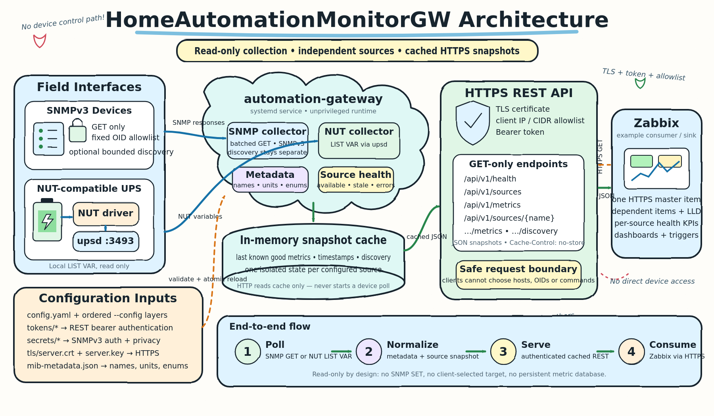

# HomeAutomationMonitorGW

HomeAutomationMonitorGW is a small, read-only Linux monitoring gateway. It polls configured NUT and SNMPv3 sources, keeps the latest values in memory, and exposes them through an authenticated HTTPS/JSON API for systems such as Zabbix.

[](docs/assets/homeautomationmonitorgw-architecture.svg)

- HTTP requests never trigger device access.
- SNMP uses configured GET/BulkWalk operations only; there is no SET path.
- NUT uses `LIST VAR` only.
- Clients cannot supply device addresses, OIDs, or protocol commands.
- One failed source does not stop other collectors; its last successful snapshot becomes stale.

## Contents

- [Software dependencies](#software-dependencies)
- [Build and installation](#build-and-installation)
  - [TLS and token permissions](#tls-and-token-permissions)
- [Cross-build and installation](#cross-build-and-installation)
- [Configuration](#configuration)
  - [NUT](#nut)
  - [SNMPv3](#snmpv3)
- [MIB metadata with `mib2json`](#mib-metadata-with-mib2json)
  - [Which MIB files are needed?](#which-mib-files-are-needed)
- [API and Zabbix](#api-and-zabbix)
  - [WAGO K-bus Visualizer widget](#wago-k-bus-visualizer-widget)
  - [Per-collector health events for Honeycomb](#per-collector-health-events-for-honeycomb)
- [Update and rollback](#update-and-rollback)
- [Security summary](#security-summary)
- [License](#license)

## Software dependencies

**Gateway runtime**

- Linux with systemd and standard Debian-family administration tools.
- No Go toolchain, Net-SNMP package, database, or CGO runtime is required.
- NUT (`nut-server`; `nut-client` provides `upsc`) is required only when this host reads a locally attached UPS.
- A TLS certificate and matching private key must be created or obtained separately, stored securely, and referenced in the configuration.

**Build and installation**

- Git.
- Go 1.23 or newer.
- `sudo` only when invoked by a normal user; root-only systems do not need it. Required system tools are checked automatically by `scripts/install.sh`.
- Internet access during `go mod download`, unless the Go module cache is already populated.

**Optional tools**

- `snmptranslate` from the Debian `snmp` package: required only on the workstation that runs `mib2json`; it is not a gateway runtime dependency.
- Node.js: optional, used only for additional Zabbix JavaScript tests.

Go dependencies are pinned through `go.mod` and `go.sum`: GoSNMP for SNMPv3 and `yaml.v3` for strict YAML parsing.

## Build and installation

The installer handles first installation and updates, accepts a locally modified checkout, and works directly as root. Its fast default downloads modules and builds; request the slower test/vet gates explicitly with `--verify`.

```bash
sudo apt update
sudo apt install --yes ca-certificates git golang-go

git clone https://github.com/tseiman/HomeAutomationMonitorGW.git
cd HomeAutomationMonitorGW
go version
./scripts/install.sh
```

The installer checks required commands and Go 1.23+, downloads checksummed modules, builds a static binary, and installs:

- `/usr/local/sbin/automation-gateway`
- `/etc/systemd/system/automation-gateway.service`
- `/etc/automation-gateway/config.yaml`
- `/etc/automation-gateway/mib-metadata.json`
- `/etc/automation-gateway/secrets/`
- `/etc/automation-gateway/tokens/`

The example configuration is intentionally not started. Configure the site-specific files, validate them, then start the service:

```bash
./scripts/install.sh --start
sudo systemctl status automation-gateway
sudo journalctl -u automation-gateway -n 50 --no-pager
```

Useful installer options:

- `--binary=PATH`: install a prebuilt binary; Go is not required on the target.
- `--verify`: run tests and vet before building.
- `--verbose` or `-v`: show detailed Go download, verification, and compilation progress.
- `--start`: explicitly enable and start an inactive valid installation.

Existing configuration, metadata, tokens, SNMP/NUT secrets, NUT configuration, and TLS files are preserved. Binary and unit files are replaced only when their content changes. Adjacent `.previous` copies are retained before replacement. Rollback is always an operator decision; the installer never restores them automatically.

### TLS and token permissions

The installer preserves these site-owned files during installation and updates. Directories must be `root:automation-gateway` with mode `0750`; token, certificate, and private-key files must be `root:automation-gateway` with mode `0640`. The service may read credentials but must not replace them.

Create or repair the directories:

```bash
sudo install -d -o root -g automation-gateway -m 0750 \
  /etc/automation-gateway/tokens \
  /etc/automation-gateway/tls
```

Install an existing certificate and key:

```bash
sudo install -o root -g automation-gateway -m 0640 \
  /path/to/fullchain.pem /etc/automation-gateway/tls/server.crt
sudo install -o root -g automation-gateway -m 0640 \
  /path/to/private-key.pem /etc/automation-gateway/tls/server.key
```

Generate and install a URL-safe bearer token without printing it:

```bash
openssl rand -base64 32 | tr -d '=\n' | tr '/+' '_-' | \
  sudo install -o root -g automation-gateway -m 0640 \
  /dev/stdin /etc/automation-gateway/tokens/zabbix
```

Repair existing files and verify everything:

```bash
sudo chown root:automation-gateway \
  /etc/automation-gateway/tokens/zabbix \
  /etc/automation-gateway/tls/server.crt \
  /etc/automation-gateway/tls/server.key
sudo chmod 0640 \
  /etc/automation-gateway/tokens/zabbix \
  /etc/automation-gateway/tls/server.crt \
  /etc/automation-gateway/tls/server.key

stat -c '%U:%G:%a %n' \
  /etc/automation-gateway/tokens \
  /etc/automation-gateway/tokens/zabbix \
  /etc/automation-gateway/tls \
  /etc/automation-gateway/tls/server.crt \
  /etc/automation-gateway/tls/server.key
```

Expected modes are `750` for both directories and `640` for all three files. Reference the token path under `authentication.bearer_token_files` and the certificate paths under `server.certificate` and `server.private_key`.

For a manual build:

```bash
go mod download
GOPROXY=off go test ./...
GOPROXY=off go vet ./...
CGO_ENABLED=0 go build -trimpath -o automation-gateway ./cmd/gateway
./automation-gateway --version
./scripts/install.sh --binary=./automation-gateway
```

## Cross-build, packaging, transfer, and installation

Cross-building means compiling on one computer (for example, macOS) for a different target. Run all build and packaging commands from the repository root—the directory containing `go.mod`. The gateway's main package is `./cmd/gateway`; omitting it makes `go build` search the repository root for Go files and fail with `no Go files`.

### 1. Determine the target architecture

Run this on the Debian or Raspberry Pi OS target:

```bash
dpkg --print-architecture
uname -m
```

Pass the corresponding architecture to the packaging script:

- `armhf` / `armv7l` → `armhf` or `armv7` → Linux `GOARCH=arm GOARM=7`, package label `armv7`
- `i386` / `i686` → `i386` or `386` → Linux `GOARCH=386`, package label `386`
- `arm64` / `aarch64` → `arm64` → Linux `GOARCH=arm64`, package label `arm64`
- `amd64` / `x86_64` → `amd64` or `x86_64` → Linux `GOARCH=amd64`, package label `amd64`

### 2. Build and package automatically

Run this on the build host, not on the target. The example path matches a checkout under the current macOS user's home directory:

```bash
cd "$HOME/work/go/HomeAutomationMonitorGW"
test -f go.mod
git status --short
git pull --ff-only

./scripts/package_release.sh arm64
```

Replace `arm64` with exactly one architecture from step 1. The script requires a clean Git worktree, downloads checksummed Go modules, injects version metadata, cross-compiles `./cmd/gateway`, creates checksums, stages only installation material, and writes the finished outputs to the **project root**.

For an untagged ARM64 commit, the outputs are:

```text
automation-gateway-linux-arm64
automation-gateway-linux-arm64.sha256
automation-gateway-<SHORT-GIT-HASH>-linux-arm64.tar.gz
automation-gateway-<SHORT-GIT-HASH>-linux-arm64.tar.gz.sha256
```

The raw binary and both portable SHA-256 files contain only relative filenames. The `tar.gz` contains exactly the runtime installation material—no Go source tree:

```text
INSTALL.txt
LICENSE
automation-gateway-linux-arm64
configs/config.example.yaml
configs/mib-metadata.example.json
scripts/install.sh
systemd/automation-gateway.service
```

Temporary staging remains under `/tmp` by default and is removed automatically. Generated release files in the project root are ignored by Git.

To additionally build a Debian package on a Linux host with `dpkg-deb` installed:

```bash
./scripts/package_release.sh arm64 --deb
```

This also creates:

```text
automation-gateway_<DEBIAN-VERSION>_arm64.deb
automation-gateway_<DEBIAN-VERSION>_arm64.deb.sha256
```

A Windows executable and ZIP are created only if the current code successfully cross-compiles for the selected Windows architecture. The gateway currently uses Unix-only secure-file and signal APIs, so the Windows probe is expected to report that Windows is unsupported and skip the ZIP. The script never publishes a misleading or incomplete Windows archive.

### 3. Understand embedded version information

Every binary built by the packaging script receives three linker values:

- `version`: the exact Git tag on `HEAD`, otherwise the 12-character Git commit hash;
- `commit`: the complete Git commit hash;
- `built`: the committed Git timestamp.

Inspect them on the matching target architecture with:

```bash
./automation-gateway-linux-arm64 --version
```

A Linux ARM64 binary cannot be executed on macOS; run this command after copying it to the ARM64 Linux target. A normal untagged build reports a short hash, for example:

```text
automation-gateway <SHORT-GIT-HASH> (commit <FULL-GIT-HASH>, built <COMMIT-TIMESTAMP>)
```

When `HEAD` has the exact tag `v1.2.3`, the same command reports `v1.2.3` as its version. A manually typed `go build` without the script's `-ldflags` reports the default development version, so use `package_release.sh` for deployable artifacts.

### 4. Verify and transfer a Linux archive

Still on the build host, derive the archive name from the same commit and verify it. This example continues with ARM64:

```bash
ARCH=arm64
VERSION="$(git describe --tags --exact-match HEAD 2>/dev/null || git rev-parse --short=12 HEAD)"
ARCHIVE="automation-gateway-${VERSION}-linux-${ARCH}.tar.gz"

shasum -a 256 -c "${ARCHIVE}.sha256"
```

Set the actual SSH user and target address once, then copy only the archive and its checksum:

```bash
TARGET_SSH='your-user@raspberry-pi-address'
scp "$ARCHIVE" "${ARCHIVE}.sha256" "$TARGET_SSH:/tmp/"
ssh "$TARGET_SSH"
```

### 5. Verify, extract, and install on the Linux target

After logging in, set the filenames copied in step 4:

```bash
ARCH=arm64
VERSION='<tag-or-short-hash-from-the-archive-name>'
ARCHIVE="automation-gateway-${VERSION}-linux-${ARCH}.tar.gz"
BINARY="automation-gateway-linux-${ARCH}"

cd /tmp
sha256sum -c "${ARCHIVE}.sha256"

INSTALL_DIR="$(mktemp -d /tmp/HomeAutomationMonitorGW-install.XXXXXX)"
tar -xzf "$ARCHIVE" -C "$INSTALL_DIR"
cd "$INSTALL_DIR"

test -x "./$BINARY"
test -x ./scripts/install.sh
file "./$BINARY"
sudo ./scripts/install.sh --binary="$INSTALL_DIR/$BINARY"
```

With `--binary`, the target does not need Go and does not download modules. Existing site-owned configuration, tokens, secrets, and TLS files are preserved. On a first installation with incomplete configuration or missing credentials, the installer intentionally leaves the service inactive. Finish provisioning and then run:

```bash
sudo ./scripts/install.sh --binary="$INSTALL_DIR/$BINARY" --start
```

For an already configured and active installation, a changed binary is installed and the active service is restarted. After a successful installation, remove only the temporary transfer material:

```bash
cd "$HOME"
rm -rf "$INSTALL_DIR"
rm -f "/tmp/$ARCHIVE" "/tmp/${ARCHIVE}.sha256"
```

### 6. Create GitHub release and Debian packages from a version tag

[`.github/workflows/release.yml`](.github/workflows/release.yml) runs only when a version tag matching `v[0-9]*` is pushed. Ordinary commits and branch pushes do **not** build or publish releases.

Create and push an annotated version tag from the clean commit to release:

```bash
git status --short
git pull --ff-only
git tag -a v1.2.3 -m "Release v1.2.3"
git push origin v1.2.3
```

GitHub Actions then:

1. checks out the tagged commit with full tag history;
2. runs the Go tests once;
3. builds `amd64`, `arm64`, `armv7`/Debian `armhf`, and `386`/Debian `i386` in parallel;
4. runs `package_release.sh <architecture> --deb` for each architecture;
5. creates or updates the GitHub Release named after the tag;
6. uploads raw binaries, checksums, minimal `tar.gz` archives, optional Windows ZIPs if supported in the future, and `.deb` packages.

Because the build runs at the exact tag, `automation-gateway --version` contains that tag instead of the normal short hash. The workflow uses GitHub's scoped `GITHUB_TOKEN` with explicit `contents: write`; no personal access token is required.

To install a downloaded Debian package, first verify its adjacent checksum and then use APT so dependencies are resolved:

```bash
sha256sum -c automation-gateway_1.2.3_arm64.deb.sha256
sudo apt install ./automation-gateway_1.2.3_arm64.deb
```

The Debian package installs the binary under `/usr/sbin`, installs a matching systemd unit, creates the restricted service account and configuration directories, rejects symlinked or non-regular configuration targets, and copies example configuration only when no site file exists. It intentionally does not enable, start, or restart the service automatically. Finish configuration and provisioning, then run:

```bash
sudo systemctl enable --now automation-gateway
```

Choose either the archive installer or the Debian package for a host; do not mix the two installation methods, because they intentionally use their platform-appropriate binary and systemd package locations.

## Configuration

Start with [`configs/config.example.yaml`](configs/config.example.yaml). Important settings:

- `server.listen`: HTTPS listen address.
- `server.certificate`, `server.private_key`: securely stored TLS files; the installer never creates or changes them.
- `authentication.bearer_token_files`: protected token files containing 16–4096 non-whitespace bytes.
- `authentication.allowed_clients`: exact client IPs or canonical CIDRs; forwarding headers are ignored.
- `sources[].driver`: `nut` or `snmp`.
- `sources[].poll_interval`, `stale_after`, `timeout`: bounded source timing.
- `sources[].nut.ups`: exact upsd UPS name.
- `sources[].snmp.oids`: fixed normal-poll OID allowlist.
- `sources[].snmp.discovery.root_oids`: optional fixed startup/reload BulkWalk roots.
- `sources[].snmp.metadata_file`: optional JSON generated by `mib2json`.
- CLI layering: repeat `--config=PATH` (short: `-C=PATH`) up to 32 times; later mappings override earlier keys, while lists and scalar values replace them. `--check`/`-c`, `--foreground`/`-f`, `--log-level=debug`/`-l=debug`, and `--version`/`-V` are accepted. CLI logging flags override YAML.

Site-owned configuration and secret files should normally be root-owned, group-readable by `automation-gateway`, and mode `0640`. Secret files must be regular files, not symlinks or devices, and must not be accessible to “other”. Configuration, secrets, tokens, and TLS directories must be `root:automation-gateway` with mode `0750`; the service account may read but must not replace its credentials.

If an older/manual setup made the token directory service-owned, repair it with:

```bash
sudo chown root:automation-gateway /etc/automation-gateway/tokens
sudo chmod 0750 /etc/automation-gateway/tokens
sudo chown root:automation-gateway /etc/automation-gateway/tokens/zabbix
sudo chmod 0640 /etc/automation-gateway/tokens/zabbix
```

Install an existing certificate and private key at the example configuration paths:

```bash
sudo install -d -o root -g automation-gateway -m 0750 /etc/automation-gateway/tls
sudo install -o root -g automation-gateway -m 0640 /path/to/fullchain.pem /etc/automation-gateway/tls/server.crt
sudo install -o root -g automation-gateway -m 0640 /path/to/private-key.pem /etc/automation-gateway/tls/server.key
```

Generate and install a URL-safe bearer token without printing it to the terminal:

```bash
openssl rand -base64 32 | tr -d '=\n' | tr '/+' '_-' | \
  sudo install -o root -g automation-gateway -m 0640 /dev/stdin /etc/automation-gateway/tokens/zabbix
```

Reference `/etc/automation-gateway/tokens/zabbix` under `authentication.bearer_token_files`.

Validate with the real service identity:

```bash
sudo -u automation-gateway /usr/local/sbin/automation-gateway \
  --config=/etc/automation-gateway/config.yaml \
  --check
```

Reload after reloadable changes; restart after changing the listen address or server timeout limits:

```bash
# Choose reload for reloadable source/auth/TLS changes:
sudo systemctl reload automation-gateway
# Or restart after changing listen/timeout settings:
sudo systemctl restart automation-gateway
sudo journalctl -u automation-gateway -n 50 --no-pager
```

At `info`, the gateway logs every HTTP request and every successful poll; poll failures are always errors. At `debug`, it additionally logs poll starts and returned metric values. Follow service activity with:

```bash
sudo journalctl -fu automation-gateway
/usr/local/sbin/automation-gateway --foreground --log-level=debug
```

### NUT

- The gateway does not access USB directly: UPS → NUT driver → local upsd → gateway.
- Keep upsd on `127.0.0.1:3493` unless the site explicitly requires otherwise.
- Use the exact UPS section name from `/etc/nut/ups.conf` in `sources[].nut.ups`.
- Test locally with `upsc UPS_NAME@127.0.0.1` before starting the gateway.
- `upsd` listening on port 3493 is not sufficient: the matching `nut-driver@UPS_NAME` must be active and `upsc` must return values. Otherwise health is `degraded`, the source is `stale`, and the gateway error log contains the concrete upsd or connection error.

### SNMPv3

- Configure the device address, authPriv account, auth protocol, privacy protocol, protected passphrase files containing 8–255 bytes, and a fixed OID list.
- Normal polling partitions the fixed list into bounded GET requests. `max_oids_per_request` defaults to `16` and accepts `1`–`32`; lower it for constrained embedded agents without removing OIDs from the allowlist. The WAGO 750-880 was observed to reject a 19-varbind GET with an unrecognized SNMPv3 report PDU while accepting 18, so `16` leaves a safety margin.
- A failed GET log identifies the affected one-based OID range, for example `OIDs 17-32 of 212`.
- Keep each OID only once. Duplicate entries waste device request capacity.
- Keep legacy SHA1/DES devices isolated inside the automation network.
- Do not treat a username such as `readonly` as proof that the device rejects writes; gateway safety comes from network policy and the absence of write code.

## MIB metadata with `mib2json`

A MIB describes names, numeric OIDs, units, types, and enum values. It does not tell the gateway what to poll: selected numeric OIDs must still be placed in `sources[].snmp.oids` or under a reviewed discovery root.

Install and build the offline tool on an admin/build workstation:

```bash
sudo apt install --yes snmp
snmptranslate -V
go build -trimpath -o mib2json ./cmd/mib2json
```

### Which MIB files are needed?

1. Obtain the MIB package for the exact device family and firmware from the device manufacturer or its support portal.
2. The primary file declares its module name near `DEFINITIONS ::= BEGIN`.
3. Its `IMPORTS` section references other modules after `FROM`. These are **dependent MIBs**. Dependencies can import further modules recursively.
4. Put the complete vendor package and required standard/vendor dependencies into one or more local directories. Do not rename module declarations inside the files.
5. Run `--list-symbols`. Messages such as `Cannot find module (SNMPv2-SMI)` name the missing dependency. Obtain that module from the vendor package or a trusted distribution source, add its directory, and repeat until no module/import errors remain.

Debian's `snmp` package provides `snmptranslate` but may not include all IETF MIB files. A vendor package may therefore need additional standard MIBs even though the command itself is installed.

List available symbols and numeric OIDs:

```bash
./mib2json \
  --mib-dir ./mibs/vendor \
  --mib-dir ./mibs/dependencies \
  --module VENDOR-MIB \
  --list-symbols
```

The list includes structural nodes and symbols imported from dependencies. Use the device manual/OID list and the primary MIB to select the readable `OBJECT-TYPE` entries that represent the values you actually need.

Convert only reviewed objects:

```bash
./mib2json \
  --mib-dir ./mibs/vendor \
  --mib-dir ./mibs/dependencies \
  --module VENDOR-MIB \
  --object deviceTemperature \
  --object deviceAlarmState \
  --output ./vendor-metadata.json

sudo install -o root -g automation-gateway -m 0640 \
  ./vendor-metadata.json \
  /etc/automation-gateway/vendor-metadata.json
```

Then set `sources[].snmp.metadata_file`, add the required numeric OIDs to the configured allowlist, and run the configuration check. `mib2json` never contacts a device and accepts no address or credentials. Review MIB licensing before redistributing vendor files or generated descriptions.

For a WAGO 750-880, [`configs/wago-750-880-metadata.example.json`](configs/wago-750-880-metadata.example.json) provides 212 reviewed, instance-specific definitions for system identity, interface health, firmware, diagnostics, IEC task health, Modbus capacity, and the discovered 19-slot K-bus inventory including global and per-module process-image lengths in bits. Its descriptions are operational guidance rather than copied MIB prose. In particular, it does not invent undocumented numeric meanings for IEC task status or mode.

```bash
sudo install -o root -g automation-gateway -m 0640 \
  configs/wago-750-880-metadata.example.json \
  /etc/automation-gateway/wago-750-880-metadata.json
```

Reference it in the matching source and reload only after a successful configuration check:

```yaml
metadata_file: "/etc/automation-gateway/wago-750-880-metadata.json"
```

## API and Zabbix

> **Compatibility note:** The Zabbix template intentionally retains its historical
> `HomeAuthMonitorGW` name, filename, group, and internal references so existing
> installations can be updated without a template migration.

Every endpoint requires both an allowed TCP peer and a bearer token:

- `GET /api/v1/health`
- `GET /api/v1/sources`
- `GET /api/v1/sources/{name}`
- `GET /api/v1/sources/{name}/metrics`
- `GET /api/v1/sources/{name}/discovery`
- `GET /api/v1/metrics`

Import [`zabbix/template_homeauthmonitorgw.yaml`](zabbix/template_homeauthmonitorgw.yaml), set `{$AUTOMATION_GATEWAY_URL}`, secret `{$AUTOMATION_GATEWAY_TOKEN}`, `{$AUTOMATION_GATEWAY_INTERVAL}`, and `{$AUTOMATION_GATEWAY_TIMEOUT}`, and keep certificate verification enabled. Add the Zabbix server/proxy's actual TCP source address to `authentication.allowed_clients`. The template uses one HTTP master item and dependent discovery/items; it never contacts NUT or SNMP devices directly.

The template stores strings as text and numeric metrics as trendable numeric items. SNMP TimeTicks are converted from centiseconds to seconds; `sysUpTime` uses Zabbix's `uptime` unit for a human-readable duration. The WAGO RTC value map displays `0` as `OK` and `1` as `Battery empty` without changing the numeric value used for alerting.

Two independent device views are included:

- **WAGO 750-880**: service health, human-readable uptime, diagnostic text, error code, RTC battery, firmware, CODESYS project and IEC task details, ordered K-bus module inventory, and cycle-time history. A warning trigger records any change to the reported K-bus slot/article/type signature.
- **Phoenix Contact UPS**: service health, NUT status, model, charge, runtime, battery temperature, output voltage, and battery history.

The core items and dashboards use `{$WAGO_SOURCE}` and `{$PHOENIX_SOURCE}`. Their defaults match the example deployment (`wago-750-880-snmp3` and `ups-main`); override them at host level when source names differ. Phoenix warning and critical thresholds are controlled by `{$PHOENIX_BATTERY_WARNING}`, `{$PHOENIX_BATTERY_CRITICAL}`, `{$PHOENIX_TEMPERATURE_WARNING}`, and `{$PHOENIX_TEMPERATURE_CRITICAL}`. The WAGO and Phoenix health items and triggers are separate. An error in one collector does not change the other collector's individual health.

Collector unavailability uses the first failed poll as a stable `unavailable_since` timestamp. As soon as that failed poll reaches Zabbix, the source availability event is **High**. If the collector remains continuously unavailable for 300 seconds, the High event closes and a **Disaster** event opens; the two severities are not kept open in parallel. The next successful poll clears `unavailable_since` and recovers either event immediately. The separate stale warning and WAGO diagnostic trigger are suppressed while the collector is unavailable, preventing duplicate problems for the same outage. Detection still depends on the configured collector poll interval and protocol timeout; the Zabbix template cannot report an outage that no collector poll observed.

`{$WAGO_MODULE_DESCRIPTIONS}` is kept as a compatibility shim consumed only by the `automation.gateway.wago.module_inventory` text item. The canonical, user-editable description table is maintained in `custom_svg_map.json` at `/var/lib/zabbix/wago_kbus/` (see the WAGO K-bus Visualizer widget section below). Descriptions require no widget reinstall or template re-import when updated.

Every source discovered later also receives its own `automation.gateway.source.health["<source>"]` item automatically. All individual and overall Zabbix health item names start with `TS Service health: `, so `{{ITEM.NAME}.regsub("^TS Service health: (.*)$", "\1")}` returns the service name. All use the same three values:

- `0` — **Good**: reachable, fresh, non-empty data and all applicable known checks pass.
- `1` — **Degraded**: not initialized, stale, empty data, missing expected health metrics, a warning threshold, or another non-critical condition.
- `2` — **Real issue / unavailable**: the collector is unavailable, a confirmed device error is present, or a critical threshold is crossed.

`automation.gateway.health.overall` is the layer above every collector. The highest state wins (`max`), so a real issue (`2`) dominates degraded (`1`) and good (`0`). Before the HTTPS master item has received its first snapshot, dependent items cannot have a value; the separate master-item `nodata(...,5m)` trigger covers that condition. A valid snapshot with no configured sources returns degraded (`1`).

### WAGO K-bus Visualizer widget

The **wago_kbus** custom widget renders a horizontal SVG rail of the WAGO controller and all
K-bus modules in numeric slot order. It is included in the WAGO 750-880 dashboard as a
replacement for the plain-text K-bus inventory widget. It supports 19+ modules through
horizontal scrolling and shows a tooltip with article number, description, and type code on
hover.

#### Prerequisites

- PHP 8.x (the Zabbix frontend PHP version).
- Zabbix 7.4 with module management enabled (`Administration → General → Modules`).
- The HomeAuthMonitorGW Zabbix template imported (this provides the
  `automation.gateway.wago.kbus_layout` item that the widget reads).

#### Widget installation

Use the provided install script for both first install and updates.  It validates the
destination, stages the new version, atomically replaces the previous installation
(removing stale files), and sets `www-data` ownership.  Running it a second time is safe.

```bash
# Clone or update the repository first:
git clone https://github.com/tseiman/HomeAutomationMonitorGW.git
cd HomeAutomationMonitorGW

# Install or update (run as root/sudo):
sudo ./scripts/install_widget.sh

# Preview without making changes:
./scripts/install_widget.sh --dry-run

# Override the Zabbix modules path (default: /usr/share/zabbix/ui/modules):
sudo ./scripts/install_widget.sh --zabbix-modules-dir /var/www/html/zabbix/ui/modules
```

> **Note:** Do not use `cp -r zabbix/modules/wago_kbus /usr/share/zabbix/ui/modules/` directly
> for updates — if the destination already exists, `cp -r` nests the source inside it and
> leaves stale files.  The install script avoids this with a stage-and-swap.

#### Enable the widget in Zabbix

1. In the Zabbix web UI: **Administration → General → Modules**.
2. Click **Scan directory** if *WAGO K-bus Visualizer* does not appear.
3. Click the **Disabled** toggle to enable the module.

#### Template import / update

```bash
# First import: via Zabbix UI → Configuration → Templates → Import
# zabbix/template_homeauthmonitorgw.yaml

# Or with Zabbix CLI (example using zabbix_sender is not applicable here; use UI import).
```

Import `zabbix/template_homeauthmonitorgw.yaml` through the Zabbix UI.  Select "Update" for all
object types when re-importing over an existing version of the template.  The
`automation.gateway.wago.kbus_layout` item will be created or updated automatically.

> **Important:** The K-bus Visualizer widget does not persist a host selection in the
> template.  After import, open the WAGO 750-880 dashboard, click the widget's edit icon,
> and select your WAGO device host manually.  This is by design: it prevents the widget from
> being silently bound to the template's internal host name on deployments where the host was
> imported under a different name.

#### Automatic controller and module identification

The physical module strip is created entirely from the runtime metrics in
`automation.gateway.wago.kbus_layout`. The widget does not read physical slots from
`custom_svg_map.json`:

1. the metric index in `wioModuleNumber[N]`, `wioModuleName[N]`, `wioModuleType[N]`, and the
   four process-image metrics associates values from the same inventory row;
2. `wioModuleNumber[N]` supplies the physical slot number;
3. modules are sorted numerically by that reported slot, independently of metric-array order;
4. `wioModulCount`, unique slots, contiguous `1..count` numbering, module names, and module
   types are checked separately from article identification.

`custom_svg_map.json` is a reusable module catalog. Each known article appears once, regardless
of where or how often it is installed. Candidate selection is strict and increasingly specific:

1. exact `SNMP_ID == wioModuleName[N]`;
2. exact catalog `type == wioModuleType[N]`;
3. equality of every available process-image bit length (`analog_in`, `analog_out`,
   `digital_in`, and `digital_out`).

Missing process-image metrics remain `null`; they are never converted to zero and never create a
false mismatch. An article is shown only when exactly one catalog candidate remains. Multiple
candidates produce `ambiguous`; no candidate produces `unknown`; missing or structurally invalid
inventory produces `data-incomplete`. These states use a transparent yellow/orange wrapper and
are not hardware faults. A non-zero `wioErrorGroup` or `wioErrorCode` produces a red global
controller/K-bus fault. `wioErrorArgument` is displayed only as global diagnostic context and is
not interpreted as a physical slot.

The process-image values are **bit lengths used as an identification signature**. They are not a
generic count of physical channels: for example, a 750-652 serial module has 192 input and 192
output process-image bits.

#### Troubleshooting: `Process image: unavailable`

If exact articles resolve but generic `750-4xx`/`750-5xx` modules remain ambiguous, verify that the
gateway publishes all four `wioModule{Analog,Digital}{In,Out}Length[N]` metrics. The fixed OID
allowlist and metadata file must map the complete instance OIDs in columns `.6.N` through `.9.N`
to those exact names; use the current
[`wago-750-880-metadata.example.json`](configs/wago-750-880-metadata.example.json). Validate the
gateway configuration, reload the service, then run **Execute now** for
`automation.gateway.snapshot` in Zabbix.

Controller matching remains catalog-based and uses exact equality between `wioArticleName` and
the controller entry's `SNMP_ID`. When the controller resolves uniquely, the widget always appends
the passive **750-600 End module** after the last runtime module. It is not part of SNMP inventory,
slot counting, article matching, or health evaluation; its detail box identifies it as the passive
K-bus terminator. The bundled image filename is
`wago_0750-0600.svg`; the generic module image remains a safe fallback if that standard asset is
missing from an incomplete installation.

#### Optional CODESYS channel labels

The widget can enrich each physical module tooltip with channel names from a CODESYS
`PLC_CONFIGURATION` export. Install the unchanged export as a root-owned, frontend-readable file:

```bash
sudo install -o root -g www-data -m 0640 \
  ./plc_configuration.export \
  /var/lib/zabbix/wago_kbus/plc_configuration.cfg
```

Replace `www-data` with the frontend group passed to `install_widget.sh` when different. The widget
accepts a regular, non-symlink file up to 2 MiB, reads only modules directly below the exported
`K-Bus`, and maps `_INDEX_IN_PARENT` to the physical slot and channel number. Non-empty
`_SYMBOLIC_NAME`, direction, and `_IECADR` values are displayed, for example:

```text
Configured I/O — 0750-0400 2 DI 24 V DC 3.0ms
Channel 1: DI_KG_Hobby_Licht
DI · %IX44.0
```

Long channel lists are constrained to the visible dashboard area and scroll vertically. The export
is display-only and is never overwritten by the installer. Replace it after every PLC hardware or
I/O mapping change; the CODESYS module name shown in the tooltip helps reveal stale assignments.

#### Custom SVG assets — persistent, update-safe

Runtime catalog data lives outside the package-managed module tree:

```text
/var/lib/zabbix/wago_kbus/
├── custom_svg_map.json     # reusable controller/module catalog (root:www-data 640)
├── plc_configuration.cfg   # optional CODESYS export             (root:www-data 640)
└── images/                 # catalog and fallback SVGs            (root:www-data 750)
```

The installer creates these paths and seeds missing files, but never overwrites an existing
`custom_svg_map.json` or destination SVG. This preserves site-local changes across widget
updates. If the frontend group is not `www-data`, pass `--web-group GROUP`.
When run as root, every existing destination-path component must be owned by uid 0 and must
not be group- or world-writable. Symlink components are rejected, and the persistent path
must not equal, contain, or be contained by the replaceable widget directory. These fail-closed
checks keep privileged copy, ownership, and mode changes inside the intended Zabbix paths.

On a fresh installation the catalog is seeded from
`zabbix/modules/wago_kbus/default_svg_map.json`. Every regular, non-symlink `*.svg` in
`assets/img/` and `catalog_images/` is copied when its destination is absent. The
`catalog_images/` directory is the versioned drop-in location for additional licensed SVGs.

**`custom_svg_map.json` schema (v2.0):**

```json
{
  "controllers": {
    "750-880": {
      "SNMP_ID": "750-880",
      "name": "750-880",
      "img": "wago_0750-0880.svg",
      "description": "WAGO 750-880 Ethernet controller"
    }
  },
  "modules": {
    "750-1405": {
      "name": "750-1405",
      "SNMP_ID": "750-4xx",
      "type": 1,
      "img": "wago_0750-1405.svg",
      "description": "16-Channel-Digital input; DC 24 V; 3 ms",
      "process_image": {
        "analog_in": 0,
        "analog_out": 0,
        "digital_in": 16,
        "digital_out": 0
      }
    }
  }
}
```

Schema rules:

- Module keys are article names and must equal the entry's `name`; numeric physical-slot keys are
  not accepted.
- Every module requires `SNMP_ID`, non-negative integer `type`, `img`, `description`, and all four
  non-negative integer process-image bit lengths.
- `img` is a basename ending in `.svg`. Symlinks, path traversal, and files outside the persistent
  images directory are rejected.
- An absent image does not invalidate identification; the generic SVG is shown and the tooltip
  explains that the catalog image is unavailable.
- Adding support for an article requires only one catalog entry and one SVG. No slot list or widget
  configuration change is required.

Existing slot-keyed v1.1 files are deliberately preserved by the installer but are not valid v2.0
catalogs. Before updating, back them up and replace their repeated slot entries with one entry per
article, using `default_svg_map.json` as the starting point.

##### Installing or extending the catalog

```bash
sudo ./scripts/install_widget.sh

# Option A: commit a licensed SVG to the versioned drop-in directory, then reinstall:
cp wago_0750-1405.svg zabbix/modules/wago_kbus/catalog_images/
sudo ./scripts/install_widget.sh

# Option B: install a site-local SVG directly:
sudo cp wago_0750-1405.svg /var/lib/zabbix/wago_kbus/images/
sudo chown root:www-data /var/lib/zabbix/wago_kbus/images/wago_0750-1405.svg
sudo chmod 640 /var/lib/zabbix/wago_kbus/images/wago_0750-1405.svg
sudo nano /var/lib/zabbix/wago_kbus/custom_svg_map.json
```

The widget reads the catalog on every page render; adding an entry or replacing an SVG requires no
Zabbix restart. Only use artwork whose provenance and redistribution licence are verified.

##### Backup and restore

```bash
# Backup:
sudo tar -czf wago_kbus_custom_$(date +%Y%m%d).tar.gz /var/lib/zabbix/wago_kbus/

# Restore:
sudo tar -xzf wago_kbus_custom_20261005.tar.gz -C /
sudo chown -R root:www-data /var/lib/zabbix/wago_kbus/
sudo chmod 750 /var/lib/zabbix/wago_kbus/ /var/lib/zabbix/wago_kbus/images/
sudo chmod 640 /var/lib/zabbix/wago_kbus/custom_svg_map.json
sudo chmod 640 /var/lib/zabbix/wago_kbus/images/*.svg
```

##### Multi-frontend synchronization

Zabbix HA or load-balanced deployments have one frontend per node; each reads
`/var/lib/zabbix/wago_kbus/` locally.  Synchronize custom assets across nodes with
configuration management (Ansible, Puppet, Chef) or a shared NFS mount at that path.

Example Ansible task:

```yaml
- name: Sync wago_kbus custom assets
  synchronize:
    src: /var/lib/zabbix/wago_kbus/
    dest: /var/lib/zabbix/wago_kbus/
  delegate_to: primary_zabbix_frontend
```

#### Adding a new built-in module SVG (for contribution to this repo)

Use this path when an SVG should ship with the widget for all users, not just
your site.  Site-specific SVGs belong in the custom asset dir above.

1. Obtain the `.elmt` source from the qelectrotech-elements repository (CC BY 3.0; see
   `tooling/qet_to_svg/PROVENANCE.md` for full attribution requirements).

   ```bash
   # Fetch one element — replace the path with the actual upstream path:
   curl -sSL \
     "https://raw.githubusercontent.com/qelectrotech/qelectrotech-elements/master/sources/industrial/WAGO/750-NNN/element.elmt" \
     -o wago_0750-NNNN.elmt

   # Convert to SVG:
   python3 tooling/qet_to_svg/qet_to_svg.py wago_0750-NNNN.elmt \
     -o zabbix/modules/wago_kbus/catalog_images/ --force
   ```

2. Add normal module images to `zabbix/modules/wago_kbus/catalog_images/` (the existing
   controller/fallback assets remain in `assets/img/`) and register the article once in
   `zabbix/modules/wago_kbus/default_svg_map.json` under the appropriate controller or
   article-keyed module entry (set `"img"` to the new filename and provide the complete
   `SNMP_ID`, `type`, and `process_image` signature).

3. Re-install the widget: `sudo ./scripts/install_widget.sh`.
   The script replaces the installed directory atomically; re-running it is safe and idempotent.

4. Run the widget tests to confirm no regressions:
   ```bash
   go test ./zabbix/...
   ```

#### Verification

After installation and template import:

```bash
# Verify the item exists and returns data (replace HOST and ZABBIX_URL):
# In Zabbix UI: Monitoring → Latest data → filter host → search "kbus_layout"

# Check the item preprocessing runs correctly (run from this directory):
go test ./zabbix/... -run TestKbusLayout -v

# Verify SVG assets are well-formed:
go test ./zabbix/... -run TestWidgetSvg -v

# Full widget test suite (PHP tests require php CLI):
go test ./zabbix/... -v
```

### Per-collector health events for Honeycomb

[`scripts/health-kpi.py`](scripts/health-kpi.py) reads the same authenticated snapshot and emits one compact NDJSON event per collector. It deliberately emits no global aggregate, so `collector_name` can be used as the Honeycomb breakdown and each collector retains its own `health_status`, `health_score`, warning count, critical count, and reasons.

```bash
./scripts/health-kpi.py \
  --url=https://monitor.example.invalid \
  --token-file=/etc/automation-gateway/tokens/zabbix
```

The token is read from a protected regular file and is never included in output. For offline checks or an existing data pipeline, pass an API response directly:

```bash
./scripts/health-kpi.py --input=/secure/path/gateway-metrics.json
# or: curl ... | ./scripts/health-kpi.py --input=-
```

WAGO events include the readable diagnostic string such as `Coupler running, OK`, uptime in seconds, RTC state, error group/code, IEC task values, Modbus capacity, K-bus module count, and firmware. Phoenix events include NUT status, battery charge/runtime/temperature/voltage, output voltage/current, and model. A WAGO RUN-state check is intentionally disabled until the numeric RUN/STOP meaning has been confirmed on the device; afterwards it can be enabled for the script with `--wago-run-status=<value>`.

The script only writes the events to stdout. Send that stdout through the site's existing OpenTelemetry Collector, Vector, Fluent Bit, or other approved Honeycomb ingestion path rather than placing a Honeycomb API key on the gateway.

## Update and rollback

Update from a clean checkout with the same installer:

```bash
cd HomeAutomationMonitorGW
git status --short
git pull --ff-only
./scripts/install.sh
sudo systemctl status automation-gateway
```

If the operator chooses to restore existing `.previous` files:

```bash
sudo install -o root -g root -m 0755 /usr/local/sbin/automation-gateway.previous /usr/local/sbin/automation-gateway
sudo install -o root -g root -m 0644 /etc/systemd/system/automation-gateway.service.previous /etc/systemd/system/automation-gateway.service
sudo systemctl daemon-reload
sudo systemctl restart automation-gateway
```

## Security summary

- Keep forwarding disabled and permit HTTPS only from approved monitoring clients.
- Keep upsd loopback-only and field-device protocols inside the automation network.
- Never place tokens, SNMP passphrases, or private keys in YAML, source control, command lines, tickets, or logs.
- Keep every API endpoint, including health, behind the client allowlist and bearer-token policy.
- Discovery roots and normal OIDs are administrator configuration, never API input.

## License

See [LICENSE](LICENSE).
